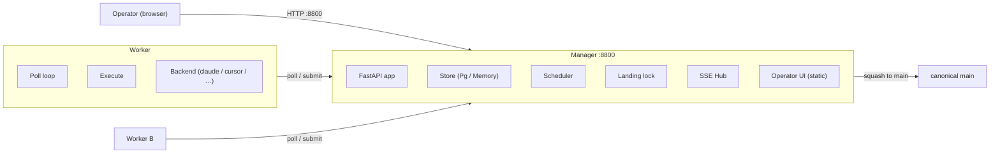
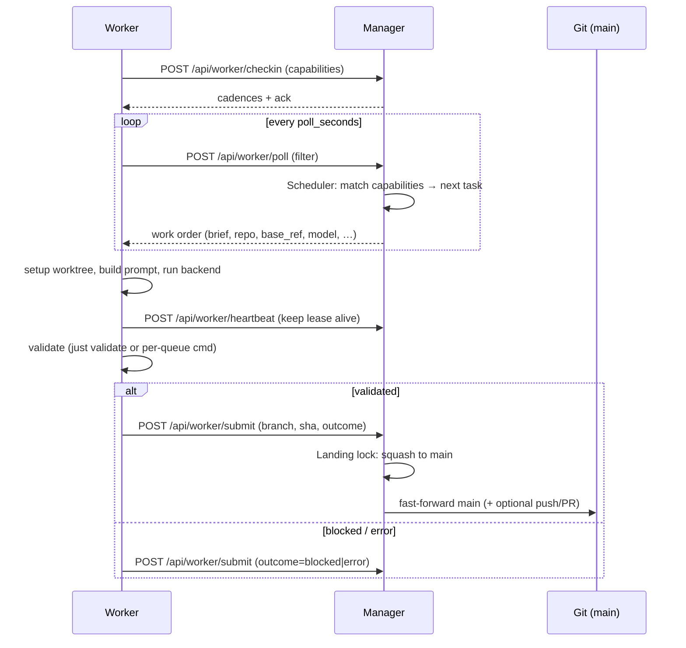

# Architecture

Nightshift is a pull-based overnight agent task runner built around a **manager / worker** split.
The manager owns state, queues, and git authority; workers own execution.

## High-level topology



## The workspace

Everything Nightshift touches lives under a single **workspace** directory (the `--workspace` arg, defaulting to `NIGHTSHIFT_WORKSPACE` or the repo root).
The workspace parents:

```
<workspace>/
  config.json              operator policy (read by the manager)
  config.json.local        worker identity + capabilities (gitignored)
  nightshift-tasks/        content-store repo: queues → briefs + per-queue config.json
  <repo>/                  one or more target repos (direct children)
  .worktrees/<repo>/       git worktrees for in-progress tasks
  .nightshift/             runtime state (UI settings, etc.)
```

Nightshift resolves repos as bare child slugs of the workspace — never absolute paths.
See `src/nightshift/repos.py` for the path-traversal guard and availability lifecycle.

## Task lifecycle



### Execution outcomes

| Outcome | Meaning | Landing |
|---------|---------|---------|
| `completed` + `landable=True` | Validated commit(s) on the task branch | Manager squashes to main |
| `completed` + `landable=False` | No commits produced (no changes needed) | Nothing to land |
| `blocked` | Agent emitted `NIGHTSHIFT_BLOCKED:` | Held for resolve |
| `error` | Launch, backend, or validation failure | Branch kept for retry/resolve |

## Component map

### Manager (`src/nightshift/manager/`)

| Module | Responsibility |
|--------|---------------|
| `app.py` | FastAPI app — worker API (`/api/worker/*`), operator API (`/api/*`), SSE (`/api/events`), static UI |
| `config.py` | Load + validate `config.json` into `ManagerConfig` |
| `store.py` | State protocol (`NightshiftStore`) + the shared SQL query layer + `PgStore` |
| `store_sqlite.py` | `SqliteStore` — the same query layer on in-memory SQLite (tests / no-DB fallback) |
| `scheduler.py` | Cross-queue next-task arbitration: capability matching, priority, round-robin tiebreak |
| `landing.py` | Git authority — conflict detection, squash, remote policy (none/push/pr) |
| `hub.py` | SSE broadcast hub for live operator UI updates |
| `registry.py` | Worker registration and liveness tracking |

The manager serves the operator UI as static files from `src/nightshift/assets/ui/`.

### Worker (`src/nightshift/worker/`)

| Module | Responsibility |
|--------|---------------|
| `loop.py` | `WorkerLoop`: checkin → poll → execute → submit cycle |
| `execute.py` | Per-task execution: worktree, prompt, backend, validate — stops before landing |
| `client.py` | HTTP client for the manager API (checkin, poll, heartbeat, submit) |
| `config.py` | Load `config.json.local` + `NIGHTSHIFT_*` env into `WorkerConfig` |
| `local_store.py` | Worker-local run history (for the worker UI) |
| `ui_app.py` | Minimal worker UI (Now + History) on `:8810` |

### Shared core

| Module | Responsibility |
|--------|---------------|
| `git/` | The git seam: `GitRunner` subprocess boundary, worktrees, squash landing, sync, transport |
| `task_files.py`, `queue_config.py` | Task lists, brief round-trips, queue order/priorities |
| `repo_tasks.py` | Repo task import: drain a target repo's `.tasks/` publishing inbox into its queue (scan the `main` tree in both legacy layouts, copy to the content store, remove from repo `main` via the landing pipeline) |
| `preflight.py`, `prompts.py` | Run preconditions, env sync, prompt building |
| `resolve_runner.py` | Conflict-resolve driver run by the manager's out-of-process resolve job |
| `backends.py` | Pluggable backend shims: `claude-code`, `cursor`, `gemini`, `anthropic`, `ollama` |
| `events.py` | Observable event types (`RUN_STARTED`, `TASK_RESULT`, etc.) |
| `repos.py` | Workspace repo addressing, slug validation, availability checks |
| `playlists.py` | Queue/playlist management |
| `spawn_daily.py` | Brief parsing (frontmatter), priority, daily spawn, autosplit |
| `render_task.py` | Brief template rendering |
| `pg.py` | The only asyncpg seam — structural pool type + `open_pool` |
| `_paths.py` | Shipped-asset vs operator-state path resolution |

### Optional

| Module | Responsibility |
|--------|---------------|
| `slack/` | Socket Mode capture daemon + outbound notifications |
| `run_local.py` | One-shot CLI runner — ephemeral in-process manager + one worker loop |

## State model

```
┌──────────────────────────────────────────────┐
│ Manager                                      │
│                                              │
│  NightshiftStore (Protocol)                  │
│  ┌────────────┐   ┌────────────────────────┐ │
│  │ SqliteStore│   │ PgStore                │ │
│  │ (fallback) │   │ nightshift.* schema    │ │
│  └────────────┘   │ workers, attempts,     │ │
│                    │ events, queue_routing  │ │
│                    └────────────────────────┘ │
│                                              │
│  Briefs: on-disk in nightshift-tasks/ repo   │
│  Landing: git ops on <workspace>/<repo>      │
└──────────────────────────────────────────────┘
```

State is split:
- **Durable coordination** (workers, leases, runs, events, routing) → Postgres via `NIGHTSHIFT_PG_DSN`.
  Falls back to an in-memory store when unset — fine for dev, state lost on restart.
- **Canonical briefs** → on-disk in the `nightshift-tasks/` git repo (committed, version-controlled).
- **Git state** → target repo clones under the workspace, with worktrees for in-progress tasks.

## Git model

The manager is the **sole writer to `main`**.
Workers never touch `main`; they produce commits on isolated task branches.

### Co-located workers

Share the workspace's repo clones.
The manager squashes the worker's branch directly via `engine.squash_to_main`.

### Remote workers (cross-machine)

Push validated branches to a **rendezvous remote** as `refs/heads/<wip_ref_prefix>/<queue>/<task>`.
The manager fetches, verifies the tip SHA matches the submitted `head_sha` (fail-closed), then lands.
See `docs/spec/remote-landing.md`.

### Landing lock

A process-wide lock (`engine.landing_lock`) serializes all landing operations.
Under the lock the manager:
1. Checks for base-ref drift / content conflict (`git merge-tree`).
2. Squashes the task branch onto `main`.
3. Applies the remote policy: `none` (local only), `push`, or `pr`.

Conflicts refuse the land and preserve the branch for a resolve pass.

## Scheduling & routing

Routing is pull-based.
On every poll, the worker advertises: `queues`, `priorities`, `models`, `mcps`.
The scheduler (`manager/scheduler.py`) does:

1. Per queue: compute the ordered runnable tasks (excluding leased, blocked, after-blocked).
2. Filter by the worker's capabilities (queue membership, priority range, model set superset, MCP superset).
3. Apply manager-side queue dedication (bind a queue to specific worker ids).
4. Arbitrate across surviving queue heads: ascending priority, round-robin tiebreak.

Model keywords `auto`, `max`, `default` are **agnostic** — any worker may serve them.
A pinned explicit model routes only to workers advertising it.

## Configuration

Precedence (highest wins): environment → `config.json.local` → `config.json` → built-in defaults.

| File | Scope | Committed |
|------|-------|-----------|
| `config.json` | Manager policy: models, cadences, forbidden paths, diff caps, landing mode | Yes (example in repo) |
| `config.json.local` | Worker identity: `worker_id`, `backend`, `models`, `mcps`, `manager_url` | No (gitignored) |
| `.env` | `NIGHTSHIFT_*` vars, `NIGHTSHIFT_PG_DSN`, API keys | No (gitignored) |
| Per-queue `config.json` | Queue order, repo binding, validate cmd, priority overrides | Yes (in `nightshift-tasks/`) |

Key `config.json` blocks:
- `manager.cadences` — `poll_seconds`, `heartbeat_seconds`, `lease_ttl_seconds`, `refresh_ms`
- `scheduled_models_allow` — filter for auto-scheduled recurring tasks (not the UI dropdown source)
- `forbidden_paths` / `forbidden_template_paths` — paths workers may not modify
- `worker_backend`, `default_model` — fallback policy

Full reference: `docs/configuration-reference.md`.

## Frontend

The operator UI and worker UI are **vanilla HTML / CSS / JS** — no React, no Vite, no build step.
Assets are shipped in `src/nightshift/assets/ui/` (operator) and `assets/ui-worker/` (worker).
The manager mounts them via FastAPI `StaticFiles`.

The operator UI:
- Connects to `/api/events` (SSE) for live state convergence.
- Calls `/api/*` for mutations (add task, reorder, settings, etc.).
- Refresh cadence is driven by `manager.cadences.refresh_ms`.

**Shared analytics module.** The Statistics page in both UIs is one shared,
self-contained module (`assets/ui/analytics.js` + `analytics.css`) — the manager
serves it at `/` and the worker mounts the same dir at `/shared`, so there is a
single implementation. It renders the measure-forward tuning views (KPI header
with prior-window deltas, daily trends, per-model/backend/queue breakdowns, a
waste panel, and harness run-shape attribution) over normalized run records.
Each host supplies a tiny `fetchRuns(sinceIso)` adapter: the manager reads
`/api/analytics/runs` (which exposes an explicit `landed` flag derived from the
raw attempt state, so cost-per-landed-change can separate a real change from a
no-change completion — a distinction the frozen `/api/runs` shape collapses);
the worker reads its local `/api/history`. Per-run `cost_usd` comes from the
owned price table (`src/nightshift/price.py`) for the harness and Anthropic
backends; CLI-reported cost (Claude Code) keeps precedence.

Changes to asset files take effect on the next browser reload (no HMR, no build).

## Testing

```bash
just test       # pytest only
just validate   # ruff + pytest
```

Tests use `tests/_workspace.py` (`build_workspace()`) to construct fake multi-repo workspaces with real git repos.
No live Postgres required — tests exercise the same SQL query layer through `SqliteStore` (in-memory SQLite).

Key test scopes:
- Manager API and worker protocol (`test_nightshift_manager.py`, `test_nightshift_worker.py`)
- Landing and conflict detection (`test_nightshift_landing.py`, `test_remote_landing.py`)
- Scheduler and capability routing (`test_nightshift_scheduler.py`)
- End-to-end workflow (`test_nightshift_workflow.py`)
- UI endpoints (`test_nightshift_ui.py`)

## Migrations

SQL migrations live in `src/nightshift/assets/migrations/`.
Applied via `just migrate` (requires `NIGHTSHIFT_PG_DSN` + `psql`); rolled back via `just rollback`.
Tracked in `_meta.schema_migrations` — idempotent on re-run.

Each migration must contain both `-- migrate:up` (applied top-down) and `-- migrate:down` (rollback) sections.
