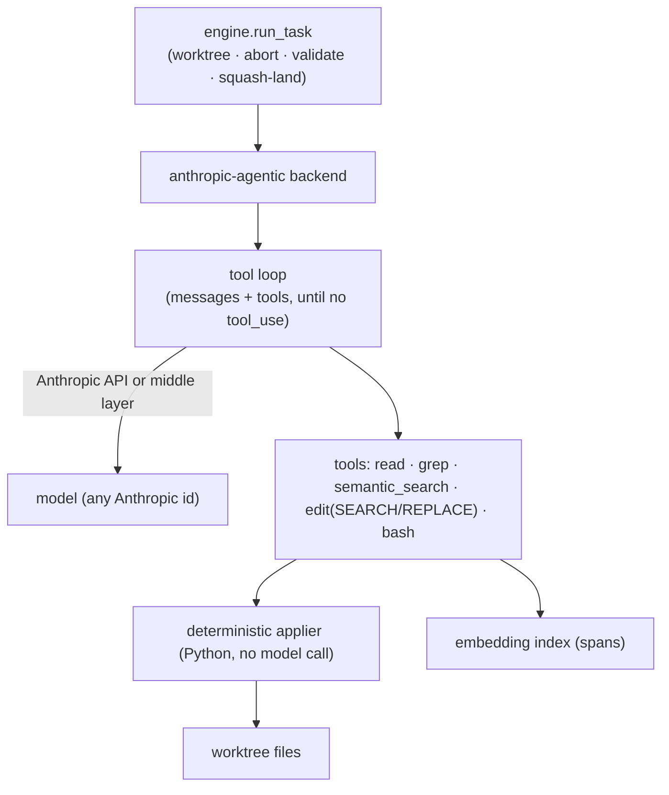

# Nightshift — Analysis: an agentic harness on the Anthropic API

**Subject:** Can Nightshift add a first-class *agentic* backend built directly on the Anthropic API (or a provider-routing middle layer) that performs as well as the `cursor` backend — fast enough to be the default, while giving access to advanced models that Cursor does not always expose?
**Status:** Analysis — informs a future design/decision. Not a committed design and not a task spec. Where this doc and code disagree once anything is built, the code governs and this doc should be updated.
**Primary sources (today):** `src/nightshift/backends.py` (`AnthropicBackend`, `CursorAgentBackend`, `_stream_subprocess`, `AgentStreamParser`, `get_backend`), `src/nightshift/engine.py` (worktrees, `build_claude_argv`, squash-land), `README.md` §Backends + §Caveats.

---

## 0. The one idea

Nightshift already has a pluggable backend seam: a worker runs exactly one backend (`claude-code` / `cursor` / `gemini` / `anthropic` / `ollama`), and the engine picks it by name.
Two of those — `anthropic` and `ollama` — talk to a model API directly but are **single-shot and non-agentic**: they stream one completion and never edit files.
Their own module docstring says they exist "to give a foundation for a future tool loop."

This analysis is about building that tool loop: turning the direct-API path into a real agentic harness that edits files, runs commands, and lands commits — competitive with the `cursor` backend on latency.

The motivating constraint is twofold:

- **Model availability.** The most capable models are not always offered through Cursor's harness; a direct-API backend can point at any Anthropic model the moment it ships.
- **Latency.** Cursor's harness is generally faster, and that is *architectural*, not a flag — so a naive direct-API loop (read whole files, verify a lot, à la a vanilla CLI agent) will feel slower even on a stronger model.

The question is whether we can keep the model-availability win **and** close most of the latency gap.

---

## 1. TL;DR verdict

Yes, with one honest caveat about scope.

- The latency gap is real and architectural, but it decomposes into three separable levers (§2). Two are pure engineering and fully reproducible; only one — Cursor's *fast-apply model* — is not buyable from Anthropic.
- We do not need to reproduce fast-apply. We can **route around** it by having the model emit precise edits that we apply **deterministically in Python** (no second model call). That captures most of the latency benefit fast-apply was buying (§3).
- Nightshift already owns ~60% of the harness: the worktree lifecycle, subprocess streaming, abort handling, telemetry parsing, the backend registry, and a direct Anthropic streaming client (§4).
- The two genuine gaps are (a) coding tools + a deterministic edit applier, and (b) a retrieval index so the agent reads *spans*, not whole files (§5).
- **The caveat:** the `claude-code` backend already gives us a direct-Anthropic, any-model, agentic path today. So this is fundamentally a **latency** project — "beat vanilla Claude Code, approach Cursor" — not a capability project. The baseline to beat is Claude Code, and that should frame the ROI (§7).

Realistic outcome: noticeably faster than a vanilla read-whole-files CLI agent, somewhat slower than Cursor, with access to any Anthropic model. Worth doing as a **phased** effort where Phase 0 is small and measurable.

---

## 2. Where Cursor's latency advantage actually comes from

The advantage is architectural, but it is not one thing.
It decomposes into three separable levers, and only one is genuinely hard to replicate:

| Lever | What it does | Why it's fast | Reproducible on the API? |
|---|---|---|---|
| **Retrieval via an embedding index** | Model sees relevant *spans*, not whole files | Less prefill (input tokens), fewer round-trips | **Yes** — pure engineering |
| **Fast-apply model** | Frontier model emits a *terse/lazy* diff (`// ... existing code ...`); a cheap fine-tuned model expands it to a full rewrite | The expensive model writes far fewer **output** tokens, and output tokens dominate latency | **No** — Anthropic exposes no fast-apply model |
| **Speculative edits, parallel tool calls, warm infra** | Overlaps work; keeps the model's context warm | Hides round-trip and serving latency | **Partly** — parallel tool calls + prompt caching yes; their serving infra no |

The non-obvious point is about the **fast-apply model**.
Its purpose is not the apply step itself; it is that the *frontier* model is allowed to be lazy and write a tiny diff, while a cheap fast model does the verbose full-file rewrite.
Output tokens are the dominant latency cost, so "let the expensive model write less" is the real win.

---

## 3. The key insight: route around fast-apply with deterministic edits

Cursor *needs* a fast-apply model because its frontier model emits lazy diffs that something has to expand.
We can avoid the whole problem.

If our harness instead requires the model to emit **exact `SEARCH`/`REPLACE` blocks** (or anchored before/after spans), we can apply them **deterministically in Python with zero model round-trips**.
This is what `aider` and, in effect, Claude Code do.

The consequence is important for the latency argument:

- The expensive model still "writes less" — a `SEARCH`/`REPLACE` block is far cheaper in output tokens than a full-file rewrite.
- The apply step costs **nothing** — it is a string operation, not a second inference call. So Nightshift's apply latency is actually *lower* than Cursor's fast-apply round-trip.

So the fast-apply moat is sidesteppable: we do not need to match it, we need to **not need it**.
What we cannot easily beat is Cursor's frontier model emitting fewer tokens than a Claude model would for the same edit, plus Cursor's serving latency.
The residual gap after §5 is mostly that, not apply.

---

## 4. What Nightshift already has (reuse map)

We are not starting from zero.
Most of a harness already exists, just wired for single-shot or for CLI subprocesses.

| Capability | Status in Nightshift | Where |
|---|---|---|
| Backend registry / single seam to pick "who does the work" | Have it | `backends.py` (`get_backend`, `_BACKENDS`) |
| Direct Anthropic streaming client (SSE, token usage capture, abort) | Have it — but **single-shot, no tools** | `backends.py` (`AnthropicBackend`) |
| Subprocess streaming + process-group abort + liveness | Have it | `backends.py` (`_stream_subprocess`) |
| Agent stream/telemetry parsing (turns, tokens, cost) | Have it | `backends.py` (`AgentStreamParser`) |
| Worktree isolation, base ref, squash-land | Have it | `engine.py` |
| Validate / repair / diff-cap / forbidden paths | Have it | `engine.py`, `config.json`, charter |
| Cursor backend to benchmark against | Have it | `backends.py` (`CursorAgentBackend`) |
| **Coding tools (read / glob / grep / edit / bash)** | **Missing** — only the *CLI* backends edit files | — |
| **Deterministic edit applier (`SEARCH`/`REPLACE`)** | **Missing** | — |
| **Embedding index / span retrieval** | **Missing** | — |

The middle-layer option: a provider-routing layer (e.g. longitude's `long_llm` gateway — LiteLLM-backed router with budgets, response cache, and a local-first fallback, or any equivalent) can sit under the harness so the same loop runs against Anthropic, a local Ollama model, or others without per-provider branching.
That also inherits cost ledgers and caching for free.
It is optional for Phase 0 (the existing `httpx` Anthropic client is enough) and becomes attractive once we want routing and budgets.

The one-line summary of the gap: `AnthropicBackend` is missing the word **agentic** — it streams a response but has no tool loop and no file edits.

---

## 5. The two real gaps

### Gap 1 — Coding tools + deterministic edits (small)

A tool set exposed to the model in tool-use format:

- `read_file`, `list_dir`, `grep` (read side),
- `edit_file` via exact `SEARCH`/`REPLACE` blocks, `write_file` (write side),
- `run_bash` (gated by the same validate/forbidden-path rules the charter already enforces).

Plus a Python applier that takes a `SEARCH`/`REPLACE` block and patches the file with no model round-trip, failing loudly on ambiguous or non-unique matches.
This is the cheap latency win and is a few hundred lines on top of the existing `AnthropicBackend` SSE loop (add `tools` to the request body, handle `tool_use` / `tool_result` blocks, loop until no tool calls).

**Prompt caching** belongs here too: mark the system prompt and stable file context with `cache_control` so repeated turns pay prefill once.
This is the single biggest *free* latency/cost lever available on the Anthropic API.

### Gap 2 — Retrieval index (the bigger lift)

This is what lets the agent read *spans* instead of whole files — the §2 retrieval lever.
It needs: a code chunker, an embedding pass (local embeddings keep it cheap and offline-friendly), a vector store (pgvector fits Nightshift's existing Postgres seam), and a `semantic_search` tool, plus a system-prompt bias toward "search for spans before reading whole files."
This is where the real work and tuning live, and it is what closes most of the residual gap with Cursor.

---

## 6. Proposed architecture and phasing

Add a new backend (e.g. `anthropic-agentic`) alongside the existing ones rather than mutating `anthropic` — keep the single-shot latency baseline intact for comparison.
It reuses the worktree, abort, telemetry, validate, and landing machinery unchanged; only the "run" step gains a tool loop.

- **Phase 0 — Agentic loop + deterministic edits (small, measurable).**
  Tool loop on top of `AnthropicBackend`; file tools; `SEARCH`/`REPLACE` applier; prompt caching.
  This alone yields "any Anthropic model, edits files, runs in a worktree, lands a commit."
  **Deliverable that justifies the rest:** a latency benchmark of this backend vs. `cursor` and vs. `claude-code` on the same task set, using the telemetry Nightshift already records (turns / tokens / wall-clock).
- **Phase 1 — Retrieval.**
  Local embeddings → pgvector → `semantic_search` tool; bias the prompt toward span retrieval over whole-file reads.
  This is the phase that actually narrows the Cursor latency gap.
- **Phase 2 — Speed polish.**
  Parallel tool execution, speculative reads, and a cheap model (Haiku-class) for sub-tasks like file selection / classification while a frontier model does the reasoning — a tiered split a middle-layer router expresses naturally.

---

## 7. Build vs. adopt, and the honest ROI

Two caveats should gate the decision before any code:

1. **We already have a direct-Anthropic, any-model, agentic path: the `claude-code` backend.**
   It runs the `claude` CLI against whatever model you point it at.
   So the "advanced models not on Cursor" problem is *already solved*; what is missing is only **speed**.
   That makes this a latency project, and **Claude Code is the baseline to beat** — the ROI question is "meaningfully faster than Claude Code, approaching Cursor," not "unlock new capability."
2. **Mature harnesses exist.**
   `aider` (SEARCH/REPLACE + repo-map) and OpenHands already implement most of Phase 0/1 against the Anthropic API and are tuned.
   A wrapper backend around one of them is a legitimate alternative to an in-house loop and would reach a competitive latency profile faster.
   The trade-off is control and dependency surface vs. build time; given Nightshift's existing primitives, a thin in-house Phase 0 is reasonable, but adopting is a real option worth costing.

Recommendation: **build Phase 0 in-house** (it is small and reuses existing primitives), **measure** against `cursor` and `claude-code`, and let that number decide whether Phase 1 (the retrieval index) is worth it or whether wrapping `aider`/OpenHands is the better path.
Do not invest in the index before the Phase 0 benchmark exists.

---

## 8. Risks and open questions

- **Edit reliability.** `SEARCH`/`REPLACE` fails when the model's anchor text is not unique or drifts from disk. Needs a strict, loud applier and a retry/repair turn — this is the main correctness risk and the main thing `aider`-style projects have already tuned.
- **Where does the residual gap land?** After §5 the remaining latency is mostly the frontier model's own output-token rate and serving latency — unfixable from our side. The benchmark must isolate this so we do not chase it.
- **Middle layer now or later?** Phase 0 can use the existing `httpx` client; introducing a routing/budget layer (e.g. `long_llm`) is an independent decision driven by whether we want tiered models and cost caps.
- **Index scope and freshness.** Per-repo index, incremental re-embed on change, and where embeddings run (local vs. paid) — all open, and all part of Phase 1, not Phase 0.
- **Charter alignment.** The agentic loop must honor the same forbidden-paths, diff-cap, and validate gates the CLI backends already obey; `run_bash` is the sharp edge there.

---

## 9. Bottom line

A direct-API agentic backend that approaches Cursor's latency is achievable, and Nightshift is unusually well-positioned because the worktree, streaming, abort, telemetry, and landing machinery already exist and the direct Anthropic client is already written.
The fast-apply moat is sidesteppable via deterministic edits.
The decision is not "can we," but "is faster-than-Claude-Code worth the retrieval-index investment, or do we wrap an existing harness" — and that is best answered by a small Phase 0 plus a benchmark, not up front.
