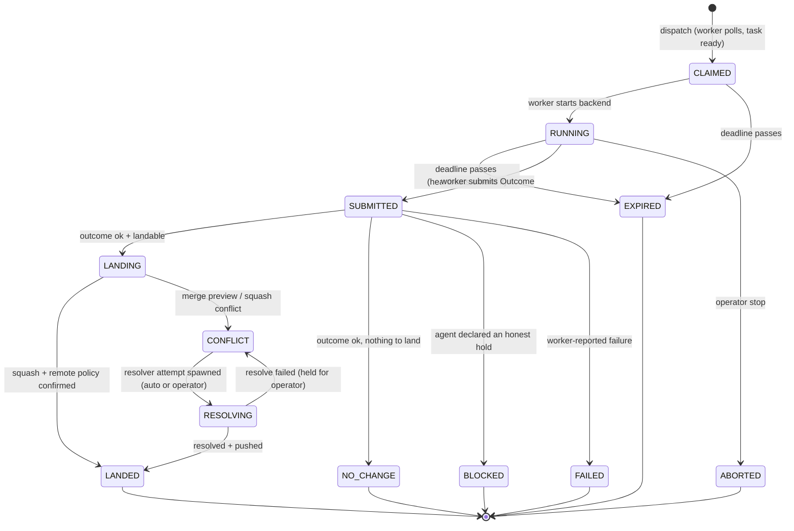

# Greenfield: Task Lifecycle — Retry, Failure & State Management

**Date:** 2026-07-02
**Status:** design spec (greenfield redesign)
**Companion:** `docs/analysis/retry-failure-state.md` — the audit of the
current implementation this design answers.

This is how retry, failure, and state management would be built from scratch,
knowing what we know now. The behavior stays the same — pull-based dispatch,
lease-with-heartbeat, validated branches, manager-only landing, blocked holds,
quarantine, out-of-process resolve. The *model* changes so that the behavior is
expressed once, in one place, instead of being re-derived at every endpoint.

## Design pillars

1. **One entity per execution: the Attempt.** Today one execution is three rows
   (lease + run + task-state overlay) mutated by separate calls. Greenfield
   merges them: an `attempt` row *is* the lease (claim + deadline), *is* the run
   (outcome + telemetry), and its state machine *is* the task's runtime status.
   Whole categories of drift ("released lease but no overlay written",
   "terminal run with live lease") become unrepresentable.
2. **State transitions are values, applied atomically.** A pure function
   computes a `Transition`; the store applies it in a single transaction and
   writes the resulting events in the same transaction (transactional outbox).
   No multi-await update sequences; a crash leaves you *before* or *after* a
   transition, never in between.
3. **Typed vocabulary, defined once.** Enums for attempt state and failure
   kind; one `Outcome` model shared by worker, wire, and store. Exhaustive
   `match` everywhere — adding a state fails compilation, not production.
4. **Retry is a declarative policy, not emergent behavior.** An attempt counter
   on the task and a policy table mapping `FailureKind → RETRY | HOLD |
   QUARANTINE`. No history scanning.
5. **Git is never state.** The ledger is the source of truth; worktrees,
   branches, and commits are artifacts a reconciler can rebuild or garbage-
   collect from the ledger. Idempotency comes from a commit trailer, not from
   probing whether a directory exists.
6. **One store implementation.** One SQL schema and one query layer, running on
   SQLite (dev, tests, single-box) and Postgres (multi-worker prod). No
   hand-synchronized MemoryStore twin.
7. **The manager's event loop never blocks on git.** All git mutation goes
   through a per-repo serialized executor. No cross-lock discipline enforced by
   docstrings.

## The state machine

One machine, owned by `lifecycle.py`, used by every component:



Terminal states: `LANDED`, `NO_CHANGE`, `FAILED`, `EXPIRED`, `ABORTED`,
`BLOCKED`. A task's runtime status is derived, never stored separately:

- **running** — it has a live (non-terminal) attempt.
- **held** — latest attempt ended `BLOCKED`/`CONFLICT`, or the reconciler set a
  hold (`repo_unavailable`, `no_capable_worker`).
- **quarantined** — `attempts_without_progress >= policy.threshold`.
- **ready** — none of the above; eligible for dispatch.

The three-way overlay table, the guard-reads that protect quarantine from
being clobbered by blocked, and the frontmatter-flag reverse-engineering in
`patch_task` all disappear: holds are one `task_hold` field with a typed reason
and a priority ordering baked into the derivation.

## Typed vocabulary

```python
class AttemptState(StrEnum):
    CLAIMED = auto(); RUNNING = auto(); SUBMITTED = auto()
    LANDING = auto(); CONFLICT = auto(); RESOLVING = auto()
    LANDED = auto(); NO_CHANGE = auto(); BLOCKED = auto()
    FAILED = auto(); EXPIRED = auto(); ABORTED = auto()

class FailureKind(StrEnum):
    # environment — the worker/box is at fault; retry elsewhere, don't count
    MODEL_UNAVAILABLE = auto(); BACKEND_UNAVAILABLE = auto()
    REPO_UNAVAILABLE = auto(); PREFLIGHT_FAILED = auto()
    LAUNCH_FAILED = auto(); PUBLISH_FAILED = auto()
    # task — the work itself failed; counts toward quarantine
    AGENT_ERROR = auto(); VALIDATION_FAILED = auto()
    # integration — landing failed; goes to resolve, not retry
    MERGE_CONFLICT = auto(); PUSH_REJECTED = auto()

class Outcome(BaseModel):
    """The one outcome shape: returned by the worker's executor, posted over
    the wire, embedded in the submit endpoint's body, persisted on the attempt.
    """
    status: Literal["ok", "blocked", "failed"]
    landable: bool = False
    failure: Failure | None = None            # kind + reason, present iff failed
    blocked_reason: str | None = None         # present iff blocked
    branch_ref: str | None = None             # cross-machine transport
    head_sha: str | None = None
    telemetry: Telemetry = Telemetry()        # turns/tokens/cost/validate_cmd/...
    result_line: str = ""
```

One model replaces today's five hand-synchronized copies (`ExecuteOutcome`,
the submit payload dict, `SubmitBody`, the run row, the local-store finish
dict). The worker's executor builds failures through a single
`fail(kind, reason)` helper instead of eight ten-kwarg constructor calls.
Every `match` on `AttemptState`/`FailureKind` carries a `never` default so new
variants fail loudly.

## Transitions: pure core, atomic shell

```python
@dataclass(frozen=True)
class Transition:
    attempt_id: str
    new_state: AttemptState
    attempt_fields: dict         # outcome, telemetry, finished_at, ...
    task_effects: TaskEffects    # hold set/cleared, progress counter delta,
                                 # brief consumed (non-evergreen land)
    events: list[Event]          # what the SSE stream should say

def on_submit(attempt: Attempt, outcome: Outcome, policy: RetryPolicy) -> Transition: ...
def on_deadline(attempt: Attempt, policy: RetryPolicy) -> Transition: ...
def on_land_result(attempt: Attempt, result: LandResult, policy: RetryPolicy) -> Transition: ...
```

These functions are pure — trivially unit-testable, no store, no git, no HTTP.
The transition table (state × input → effects) is data you can read in one
screen; it replaces the 260-line `worker_submit` branch cascade, the
quarantine helpers, and the overlay bookkeeping in the poll path.

The store applies a transition in **one transaction**:

```python
async def apply(self, t: Transition, *, expected_state: AttemptState) -> bool:
    """Compare-and-swap on attempt state. Returns False (no writes) when the
    attempt is no longer in expected_state — the fencing guard."""
```

- **Fencing is structural.** Every worker call carries `attempt_id`; `apply`
  CASes on the current state. A submit for an `EXPIRED` or `ABORTED` attempt
  returns 409 and lands nothing — the double-land hole cannot exist.
- **Events are the outbox.** `t.events` are inserted in the same transaction;
  the SSE hub tails the events table. An event can never describe a transition
  that didn't commit, and vice versa.
- **Heartbeat is the one non-transition write:** a deadline extension, CASed on
  a live state.

## Retry & quarantine policy

```python
@dataclass(frozen=True)
class RetryPolicy:
    quarantine_after: int = 3          # no-progress attempts before quarantine
    immediate_quarantine: bool = False # worker quarantine mode
    backoff: Backoff = Backoff(base=60, cap=3600)

    def on_failure(self, kind: FailureKind) -> Action:  # RETRY | HOLD | QUARANTINE
```

- The task row carries `attempts_without_progress`, incremented/reset inside
  the transition (a land or `NO_CHANGE`-with-commits resets it; task-category
  failures and no-change runs increment it; environment failures, aborts, and
  blocks are neutral). Quarantine is an O(1) threshold check — the 50-run
  history scan and its window-eviction bug are gone.
- `RETRY` sets `next_eligible_at` (backoff) on the task, so a hot-failing task
  doesn't spin the queue; dispatch simply skips tasks whose backoff hasn't
  elapsed. Today's "errored task re-leases immediately, forever" becomes an
  explicit, tunable policy.
- Environment failures (`MODEL_UNAVAILABLE`, `PREFLIGHT_FAILED`, …) never
  count toward quarantine but *do* set a worker-scoped cooldown, so a broken
  box stops eating the queue while healthy workers retry the task.

## Landing: a per-repo serialized pipeline

The manager owns a `RepoExecutor` per target repo — one worker thread with a
job queue. All git mutation (land, origin sync, resolved-push, PR branch push)
runs as jobs on that executor:

- **Serialization is topological, not lock-based.** One thread per repo means
  no `landing_lock`, no `integrate_lock`, no "never nest these flocks"
  docstrings, no self-deadlock class. A single flock per repo remains solely to
  guard against out-of-band CLI use.
- **The event loop never blocks.** `worker_submit` transitions the attempt to
  `LANDING`, enqueues a land job, and returns. The land result comes back as
  `on_land_result` — just another transition. (The worker doesn't need the
  land result synchronously; today's response already treats it as advisory.)
- **One integrate-and-push loop.** `integrate_and_push(repo, apply_commit,
  retries)` implements sync-origin → apply → push → retry-on-non-fast-forward
  once; the normal land (apply = squash) and the resolved land (apply =
  cherry-pick) are two thin callers. The resolver subprocess no longer pushes
  origin itself — it reports the resolved SHA and the manager's executor lands
  it, which is what deletes the cross-process integrate lock.
- **Idempotent lands.** Every squash commit carries a trailer
  (`Nightshift-Attempt: <id>`). Recovery after a crash mid-land checks
  `main` for the trailer instead of guessing from branch presence; a re-run of
  the land job is a no-op if the trailer is already on `main`.
- **"Agent landed on main directly" has one owner.** Only the land job checks
  base-ref advance + empty branch and returns `LandResult(adopted=True)`.
  Neither the worker nor the submit endpoint knows the case exists.

## Reconciler: recovery and hygiene in one loop

A single periodic manager task (and a pass at startup) replaces today's
scattered write-on-read behavior:

- expire attempts past deadline (`on_deadline` transitions, CASed);
- set/clear `repo_unavailable` and `no_capable_worker` holds — moved *out* of
  the poll hot path, which becomes pure pick → claim → return;
- garbage-collect worktrees/branches whose attempt is terminal and landed, and
  prune consumed rendezvous WIP refs;
- re-enqueue `LANDING` attempts found at startup (idempotent via the trailer);
- mark workers offline past heartbeat TTL.

Because queue pause/mode and resolve bookkeeping live in the store instead of
`app.state`, a manager restart resumes exactly where it left off — nothing
silently unpauses.

## Storage

One schema, one implementation, two backends (SQLite / Postgres) behind a thin
dialect seam:

```
tasks      task, queue, repo, priority, hold(kind, reason)?, attempts_without_progress,
           next_eligible_at, evergreen, updated_at
attempts   id, task, queue, worker_id, state, deadline_at, base_ref, model, backend,
           outcome jsonb, telemetry jsonb, created_at, finished_at
events     id serial, attempt_id?, queue?, task?, kind, payload jsonb, ts
workers    id, capabilities jsonb, status, cooldowns jsonb, last_heartbeat_at
```

- Briefs stay canonical on disk in `nightshift-tasks/` (that part of the
  current design is right); the `tasks` row is runtime state keyed to the
  brief, created on first sight and dropped when the brief is consumed.
- Uniqueness "one live attempt per task" is a partial unique index on
  `attempts(queue, task) WHERE state IN (live states)` — same trick as today's
  lease index, but now it guards the *only* execution entity.
- Stats are views over `attempts`; `finished_at` is set by the transition
  applier for every terminal state (the "blocked runs never finish" drift
  class can't recur because terminality is defined once, on the enum).
- Field vocabulary comes from the models: the updatable-column set is derived
  from `Outcome`/`Telemetry`, and unknown fields raise instead of being
  silently dropped.

## Module layout

```
src/nightshift/
  lifecycle.py           # enums, Outcome, Transition, pure state machine + policy
  store.py               # one SQL store; apply(transition) is the write path
  gitops/
    worktree.py          # setup/teardown/has_commits
    integrate.py         # integrate_and_push, squash, sync, trailer idempotency
    executor.py          # per-repo serialized job executor
  manager/
    api_worker.py        # claim / heartbeat / submit / events — thin: parse,
                         # CAS-guard, compute transition, apply, enqueue land
    api_operator.py      # operator API + SSE
    dispatch.py          # capability matching, priority, round-robin (as today)
    reconciler.py        # deadlines, holds, GC, startup recovery
    resolve.py           # resolver subprocess spawn/report (no git push)
  worker/
    executor.py          # backend run + validate → Outcome (no manager imports)
    loop.py              # claim → execute → submit
```

Nothing exceeds ~500 lines. The worker imports `lifecycle` and `gitops`, never
`manager.*`. Today's `engine.py` dissolves into `gitops/` + `lifecycle` + the
brief/queue CRUD it also contains (which moves next to `playlists`); the
legacy single-process runner and the `events.py` `RunStore` fold — a third,
parallel history reconstruction — are retired rather than ported.

## Invariants (the checklist the design is judged against)

| # | Invariant | Enforced by |
|---|-----------|-------------|
| 1 | A task has at most one live attempt | partial unique index |
| 2 | A submit for a non-live attempt writes nothing | CAS in `store.apply` |
| 3 | State + events change together or not at all | single-transaction outbox |
| 4 | Every terminal attempt has `finished_at` | terminality defined on the enum, set by the applier |
| 5 | A land is applied at most once per attempt | commit trailer idempotency |
| 6 | Only the repo executor mutates a target repo | topology (one thread per repo) |
| 7 | The manager event loop never runs git | all git behind the executor |
| 8 | Quarantine/backoff decisions are O(1) | counters maintained by transitions |
| 9 | Manager restart loses no state | no lifecycle state in `app.state`; startup reconciler |
| 10 | Adding a state or failure kind breaks the build until handled | exhaustive `match` + `never` defaults |

## What deliberately does not change

- The manager/worker split, pull-based polling, and the capability-matching
  scheduler — the arbitration logic in `manager/scheduler.py` is clean and
  ports as-is.
- Briefs as markdown-with-frontmatter in a content-store repo.
- The rendezvous-remote transport for cross-machine workers, including the
  fail-closed `head_sha` verification.
- The out-of-process resolver as a subprocess (only its push authority moves
  to the manager).
- Squash-to-main semantics, autostash of operator WIP, and the
  `none | push | pr` remote policy.

## Migration sketch (if evolved rather than rebuilt)

The analysis doc's sequencing gets most of the way here incrementally:
fence submits (invariant 2) → typed `Outcome` (pillar 3) → transition model +
atomic apply (pillars 1-2) → repo executor (pillars 6-7) → counters replace
scans (pillar 4) → merge lease+run into attempts and drop the overlay table
(the schema step, last, behind a migration in
`src/nightshift/assets/migrations/`).
