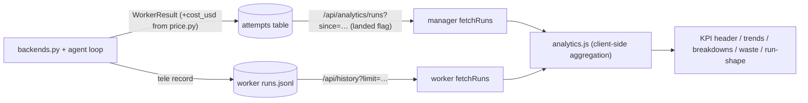

# Nightshift — Measure-Forward Tuning Metrics + Shared Analytics UI

**Subject:** The measurement foundation for tuning the in-house agentic harness (repo map, admission caps, failure fuses, model routing) against **production telemetry instead of benchmarks**. This covers three things that ship together: an owned price table that makes per-run `cost_usd` computable for every backend that reports tokens, a time-windowed way to read run records, and one analytics UI — a single shared module — rendered by both the manager (fleet-wide) and the worker (local).
**Status:** Implemented. Where this doc and the code disagree, the code governs and this doc should be updated.
**KPI:** **Cost per landed change** — baseline **$2.24**, target **≤ $1.50** at land rate ≥ 70% (see [2026-07-03-token-usage-analysis.md](2026-07-03-token-usage-analysis.md)).
**Primary sources:** `src/nightshift/price.py`, `src/nightshift/backends.py` (`NightshiftAgentBackend.run`, `AnthropicBackend.run`, `AgentStreamParser.apply`), `src/nightshift/manager/store.py` (`SqlStoreBase.list_attempts`), `src/nightshift/manager/api_operator.py` (`/api/runs`, `/api/analytics/runs`), `src/nightshift/manager/views.py` (`analytics_run_view`, `ANALYTICS_RUN_KEYS`), `src/nightshift/assets/ui/analytics.js` + `analytics.css`, `src/nightshift/assets/ui/app.js` + `assets/ui-worker/app.js` (`renderStats`), `src/nightshift/worker/local_store.py` (`LocalStore.finish`), `src/nightshift/lifecycle.py` (`Outcome` / `Telemetry`).

---

## 0. The one idea

Harness tuning is a **measure-forward** discipline: we change a knob, then judge it by what live runs cost and land — not by replaying a fixed benchmark. Rewind-style benchmarking was rejected because the task queue *is* the codebase's change history: the code has already moved on by the time a run finishes, and out-of-band edits make a clean replay impossible.

So the deliverable is instrumentation, not a benchmark harness. Three parts:

1. **Complete cost data** — every run that reports tokens can report a dollar cost (§1).
2. **Time-windowed access** — read run records since an instant, so "this week vs last week" is a query (§2).
3. **One analytics UI** — a shared module both surfaces render, showing the KPI and its drivers with prior-window deltas (§3–4).

Explicitly out of scope: benchmark/rewind projects, and the harness knob changes themselves — those come *after*, measured against this instrumentation.

---

## 1. Price table — `cost_usd` made universal

### 1.1 The gap

The KPI is **cost per landed change**, so a run with no `cost_usd` is invisible to it. Before this work, the two backends we most want to tune left cost unset:

- `NightshiftAgentBackend` (the in-house harness) returned `cost_usd=None`.
- `AnthropicBackend` (single-shot completion) returned `cost_usd=None`.

Only the CLI backends (Claude Code) reported a cost, and only because their CLI prints `total_cost_usd`. The harness path — the whole point of the tuning effort — was uncomputable.

### 1.2 The module

`src/nightshift/price.py` is a small, **version-controlled rate sheet** plus a pure function:

```python
cost_of(model: str | None, usage: dict | None) -> float | None
```

- Rates are **USD per million tokens**, keyed on a normalized model name.
- `normalize_model` peels `provider/` prefixes — including the harness's double segment (`nightshift/anthropic/claude-…`) — lowercases, and drops a trailing 8-digit `-YYYYMMDD` date stamp.
- Cache economics follow Anthropic's published multipliers: a cache **write** (creation) bills at **1.25×** the base input rate, a cache **read** at **0.1×**. `usage.input_tokens` is the *uncached* input (Anthropic reports the cache splits separately), so the three input components are additive and priced distinctly.
- **Unknown model → `None`, not a guessed zero.** A missing price is visibly missing. Ollama/Gemini have no meaningful public per-token price, so they stay `None`, and the analytics UI is built to handle missing cost.

```
input_cost  = uncached·rate_in
            + cache_read·rate_in·0.1
            + cache_creation·rate_in·1.25
output_cost = output·rate_out
cost_usd    = (input_cost + output_cost) / 1e6
```

### 1.3 Wiring + precedence

- `NightshiftAgentBackend.run` and `AnthropicBackend.run` now compute `cost_usd = price.cost_of(model, usage)` from the accumulated Anthropic-shaped usage (cache splits already captured by the loop).
- **CLI-reported cost keeps precedence.** `AgentStreamParser.apply(result, model)` sets `cost_usd` from the CLI's `total_cost_usd` when present; the price table is a *fallback* only for CLI runs where the cost was omitted but usage was reported.

This keeps a single source of truth for the price of a closed harness (its own bill) while giving the owned paths an honest, regression-testable number.

---

## 2. Time-windowed run access

### 2.1 Manager: `since` on the shared SQL layer

`SqlStoreBase.list_attempts` gained an optional `since` (ISO-8601 timestamp) clause: `started_at >= $N`. Because the base class is shared, both `PgStore` (native timestamp comparison) and `SqliteStore` (ISO text stored at fixed-microsecond precision, so lexicographic order == chronological order) get it for free. It composes with the existing `queue` / `worker_id` filters.

Run records already carry everything the analytics need via the token-usage-granularity work: `turns`, `input_tokens`, `output_tokens`, `cache_read_input_tokens`, `cache_creation_input_tokens`, the raw `usage` jsonb (incl. the harness's `per_turn` detail), `cost_usd`, and the timestamps.

### 2.2 Two endpoints, one frozen and one for analytics

`GET /api/runs` gained a `since` param, but it keeps its **frozen, byte-identical wire shape** (`run_view` / `RUN_VIEW_KEYS`) — a shape that deliberately collapses `LANDED` and `NO_CHANGE` into a single `completed` status and hides the raw `state`.

The KPI needs to tell a **landed change** from a **no-change completion**, which that frozen shape can't express. Rather than mutate it (and break its many consumers + the SSE snapshot), a dedicated endpoint was added:

```
GET /api/analytics/runs?since=<iso>&limit=<n>&queue=<name>
```

It returns `analytics_run_view` records (`ANALYTICS_RUN_KEYS`) with an explicit **`landed`** boolean derived from the raw attempt `state` (`state == "landed"`). Higher default `limit` (2000) so a 30-day window aggregates client-side.

### 2.3 Worker: local parity, no reshaping

The worker serves full local records at `GET /api/history` straight from `runs.jsonl`. Those records already match the analytics shape: `LocalStore.finish` writes `Outcome.model_dump(...)` (which includes the whole `Telemetry` slice — turns, tokens, cache splits, `usage`, `cost_usd`) plus `status`, `landed`, `model`, `backend`, `queue`, `task`, and the `started_at` / `finished_at` stamps. So the worker adapter does **no server-side reshaping** — it fetches and lets the shared module normalize client-side. A lifecycle test guards this field set against a future drop.

No new tables or SQL views: at current volumes (hundreds of runs) aggregation is cheap client-side.

---

## 3. Shared analytics module

### 3.1 One implementation, two mounts

`src/nightshift/assets/ui/analytics.js` + `analytics.css` live in the operator UI asset dir. The manager serves that dir at `/`; the worker mounts the *same* dir at `/shared` (already used for `style.css` / `logo.png`). So there is exactly one analytics implementation, referenced as `/analytics.js` (manager) and `/shared/analytics.js` (worker). Vanilla JS, no build step, hand-rolled SVG micro-charts — no chart library, no host-global dependencies (it ships its own formatting helpers).

### 3.2 API + record contract

```js
Analytics.render(container, {
  title: "Analytics",
  fetchRuns: async (sinceIso) => [ /* normalized run records */ ],
});
```

Each host supplies a tiny `fetchRuns(sinceIso)` adapter. A **normalized run record** (both adapters produce this):

```
{ task, queue, model, backend, worker_id, status, landed,
  turns, input_tokens, output_tokens,
  cache_read_input_tokens, cache_creation_input_tokens,
  cost_usd, usage, failure_kind, started_at, finished_at }
```

`landed` is true only for a real change reaching main — the manager derives it from the raw attempt state; the worker reads its explicit `landed` flag.

### 3.3 Views

All views are filterable by **time window** (24h / 7d / 30d / all) and by **dimension** (all / model / backend / queue, with a value picker populated from the loaded runs).

- **KPI header** — cost per landed change, land rate, avg tokens/task, avg turns, cache hit rate. Each shows a **delta vs the immediately-preceding window of equal length** (the measure-forward mechanic): to make that possible, `fetchRuns` requests **2× the window span** and the module splits current vs prior client-side. Deltas are colored by whether the direction is good (e.g. lower cost is good, higher land rate is good).
- **Trends** — per-day series (spend on landed, avg tokens/task, land rate) as SVG bars; shown only when ≥ 2 days of data exist.
- **Breakdowns** — by model / backend / queue, plus by worker when more than one is present. Columns: runs, land %, $/landed, avg turns, cache %, cost. This is the live Sonnet-vs-Opus comparison from the analysis doc.
- **Waste panel** — non-landed spend, validation-failure burn (`failure_kind == "validation_error"`), never-landed retries (tasks attempted ≥ 2× that never landed, grouped by `task`), and the top-5 most expensive runs.
- **Run shape** (harness runs with `usage.per_turn`) — median input-delta by turn index, and per-tool token attribution across runs. Uses the documented delta method: `input(N) − output(N−1) ≈` the tokens turn (N−1)'s tool calls appended to the transcript, split across those calls by `result_chars`. Computed entirely client-side; when `result_chars` is unavailable the split falls back to even and is labeled as estimated. Instrumented harness runs (see [2026-07-04-harness-telemetry-metrics.md](2026-07-04-harness-telemetry-metrics.md)) additionally surface cache localization, the model-vs-tools time split, per-tool latency/error/truncation, turn composition, exit reasons weighted by spend, and marginal turn yield.

### 3.4 Missing-data honesty

Because Ollama/Gemini report no cost, every cost figure guards on presence: a group with no priced runs shows `—`, not `$0.00`. Token throughput uses `input_tokens` directly (which already folds cache tokens in), so cache splits are never double-counted.

---

## 4. Integration into both UIs

Both `renderStats()` implementations now delegate to the shared module; the previous client-side renderers are retained as `renderStatsLegacy()` (unused) in case a lightweight inline fallback is ever wanted.

- **Manager** ([assets/ui/app.js](../../src/nightshift/assets/ui/app.js)): the Statistics page mounts `Analytics.render` fed by `/api/analytics/runs?since=…&queue=…`. `/api/stats` (the old aggregate view endpoint) stays for any other consumer, but the UI no longer depends on it.
- **Worker** ([assets/ui-worker/app.js](../../src/nightshift/assets/ui-worker/app.js)): same module via `/shared/analytics.js`, fed by `/api/history?limit=5000` (the worker endpoint has no `since` param, so it fetches a generous window and lets the module window client-side by `started_at`).

**Mount lifecycle.** The module owns its own view state (window, dimension filter). It is mounted **once** and left alone across the host's periodic refreshes (SSE on the manager, poll tick on the worker) so a refresh never resets the operator's selections. Explicit navigation *to* the stats page resets the mount flag, so switching queues (manager) reloads with the new scope. A `_analyticsMounted` guard at the top of each app implements this.

---

## 5. Data flow



---

## 6. Tuning: how to use this to move the KPI

The instrumentation exists to make one number — **cost per landed change** — go down without dropping land rate. The intended loop:

1. **Read the baseline.** Open the Statistics page (manager for fleet-wide, worker for a single machine), pick a window (7d is the usual working window). Note cost/landed, land rate, avg tokens/task, avg turns, cache hit rate.
2. **Find the biggest lever.** Use the breakdowns to see *where* the spend is:
   - **By model** — is `auto` routing to an expensive model for work a cheaper one lands? (The analysis doc's R3 "sonnet-first `auto`".) Compare `$/landed` across models at equal land rate.
   - **By backend** — is the owned harness actually cheaper than the CLI it's meant to replace, per landed change? This is the payoff metric for `agentic-backend.md`.
   - **Cache hit rate** — a low rate means the byte-stable charter + prompt-cache breakpoints (`agent/loop.py`, spec invariant 7) aren't landing on the cache; this is the metric they exist to move.
3. **Look at waste.** Non-landed spend and validation burn are pure loss; never-landed retries are compounding loss. These point at failure-policy and repair changes (analysis doc R2/R5), not model changes.
4. **Look at run shape** (harness). Median input-delta by turn shows context growth; per-tool attribution shows *which* tool is inflating the transcript — the target for tool-result eviction / admission caps (R4). A single tool dominating the delta is the signal.
5. **Change one knob, then re-measure forward.** After a change has ~a week of history, re-open the same window and read the **delta badges** — they compare against the prior equal window automatically. Success is cost/landed trending toward ≤ $1.50 with land rate held ≥ 70%.

Because measurement is forward-only, prefer **one change at a time** with enough history between changes to separate signal from noise (the analysis doc warns some cells have small samples; trust the ordering over exact percentages).

---

## 7. User configuration

There is intentionally **little to configure** — the analytics UI is derived from data already recorded, and the price table is code, not runtime state.

### 7.1 What's automatic

- **Both Statistics pages** work with no setup. The manager reads the fleet's `attempts`; the worker reads its local `runs.jsonl`. No flags, no migration beyond the token-usage-granularity migration that already added the cache/`usage` columns.
- **Cost appears automatically** for priced models. Anthropic models (harness or single-shot) and Claude Code runs report `cost_usd`. Ollama/Gemini runs correctly show no cost.
- **Theme** follows the host UI's light/dark toggle — `analytics.css` uses the shared theme variables from `style.css`.

### 7.2 The one thing you maintain: the price table

`src/nightshift/price.py` is a rate *sheet*, not a catalog. It is deliberately code so a price is reviewable in version control and testable.

- **When a new model starts being used**, add a row: `"<normalized-model>": (input_rate, output_rate)` in USD per million tokens. Until then that model's runs show cost `—` (honest, not zero).
- **When vendor pricing changes**, update the affected rows. That is the entire reason the table is owned rather than fetched.
- Model ids are matched **after normalization** (provider prefixes stripped, date suffix dropped), so `anthropic/claude-opus-4-8`, `nightshift/anthropic/claude-opus-4-8`, and `claude-opus-4-8-20260514` all resolve to the same row.

There is **no runtime config knob** for prices (no `.env` override, no `config.json` field): a price is a fact about a vendor, versioned with the code that computes cost. If a per-deployment override is ever needed, that is a future addition to `price.py` + the configuration reference, not an existing surface.

### 7.3 Adjusting what you see

- **Time window / dimension filters** are in-UI (not persisted) — they reset when you navigate away and back, by design, so the page always opens on a known state.
- **Manager queue scope** follows the active playlist: the analytics page scopes to the focused queue via the `queue=` param.
- **History depth** is bounded by the endpoint limits (`/api/analytics/runs` default 2000, worker `/api/history` fetched at 5000). At current volumes these comfortably cover an "all" window; if a deployment outgrows them, raise the adapter's `limit` (a code change in the `fetchRuns` adapter, not user config).

---

## 8. Testing

- **Price math** (`tests/test_price.py`): uncached + output arithmetic, cache-multiplier arithmetic (0.1× / 1.25×), unknown model → `None`, missing usage → `None`, `normalize_model` prefix/date handling.
- **`since` filter** (`tests/test_nightshift_store.py`): past bound returns all, future bound returns none, composes with `worker_id`.
- **Analytics endpoint** (`tests/test_nightshift_manager.py`): exact `ANALYTICS_RUN_KEYS` shape, `landed` true only for `LANDED` (false for `NO_CHANGE` / `FAILED`), `since` wired through.
- **Backend cost** (`tests/test_nightshift_agent_backend.py`): a harness run now reports the price-table `cost_usd` over its accumulated usage.
- **Worker record parity** (`tests/test_lifecycle.py`): the on-disk finish record carries every field the shared analytics module consumes.

---

## 9. Relationship to other specs

- **[2026-07-03-token-usage-analysis.md](2026-07-03-token-usage-analysis.md)** — the measured findings and the R1–R5 recommendations this instrumentation exists to evaluate; its §4 telemetry gap (cache visibility, then the cost side) is closed here.
- **[agentic-backend.md](agentic-backend.md)** — the owned harness whose token budget this makes measurable; the harness's "own the token budget" promise is only verifiable once `cost_usd` is computed for its runs.
- **[configuration-reference.md](configuration-reference.md)** — the broader config surface; the analytics feature adds no new runtime configuration (the price table is code).
