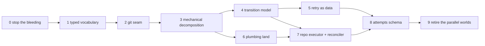

# Rebuild In Place — Migration Plan

**Date:** 2026-07-02
**Status:** plan
**Targets:**
[`greenfield-task-lifecycle.md`](greenfield-task-lifecycle.md) (retry / failure /
state) and [`git-management-greenfield.md`](git-management-greenfield.md) (git
layer), driven by the findings in
[`../analysis/retry-failure-state.md`](../analysis/retry-failure-state.md) and
[`../analysis/git-management-review.md`](../analysis/git-management-review.md).

This plan rebuilds Nightshift into the two greenfield designs **in place** — no
parallel implementation, no long-lived branch, no big-bang cutover. Ten phases.
Each phase is independently landable, leaves `just validate` green and the
system fully operational, and is ordered so that (a) the highest-leverage
changes come first and (b) every phase makes the phases after it smaller.

## Ground rules

1. **Every phase lands on `main` alone.** If a phase can't ship without the
   next one, the boundary is wrong — split differently.
2. **Wire and disk formats stay compatible until the phase that migrates
   them.** All new enums are `StrEnum`s whose values are today's literal
   strings, so JSON payloads, DB rows, and the operator UI are byte-identical
   until Phase 9 deliberately changes the schema.
3. **DB changes ride the existing migration system**
   (`src/nightshift/assets/migrations/`, up + down sections, idempotent).
4. **Behavior changes are opt-out visible.** Phases 0–8 are
   behavior-preserving except where the analysis found bugs (those fixes are
   called out per phase). Operator-visible behavior changes cluster in
   Phases 7 and 9 and are listed there.
5. **Each phase ends with its own verification step**, not just the shared
   suite: the tests added in that phase must fail against the pre-phase code.

## Phase map

---

## Phase 0 — Stop the bleeding

*Small, surgical fixes for the live correctness holes. Nothing structural.*

**Lands:**

- **Fence `worker_submit` on lease validity**: lease exists, `status ==
  'leased'`, `worker_id` matches the submitter — otherwise 409 and no writes.
  Closes the double-land hole (analysis §1). Same guard on the
  `resolve-result` endpoint (origin run must still be in a resolvable state).
- **Unblock the event loop minimally**: `await asyncio.to_thread(...)` around
  `land(...)`, `drop_completed_task`, and `compute_code_loc` in
  `worker_submit`. The submit fence above is what makes this safe to do first
  (a re-leased task's stale submit is now rejected, not raced).
- **Fix the two git data-loss hazards** (git review §1.4): in
  `_sync_main_to_origin_impl`, a failed `git stash create` must *refuse* the
  sync (mirror `squash_to_main`'s `wip_sha is None` guard), never proceed to
  `reset --hard`; and `_replay_commits` must return dropped SHAs so the sync
  result / `LandingResult.detail` reports them, instead of returning `None`.

**Why first:** these are the only findings that lose data or land wrong
commits *today*. Everything later is easier to review when the reviewer isn't
also worrying about live holes.

**Verification:** new tests — stale/expired/cancelled-lease submit is
rejected with 409 and no store or git writes; stash-create failure aborts the
sync with WIP intact; a rescue that drops a commit surfaces the SHA. Each red
before the fix.

**Size:** small (three focused PRs). **Risk:** low; pure tightening.

---

## Phase 1 — One typed vocabulary

*Define every status, kind, and outcome shape exactly once. Mechanical; the
wire format does not change.*

**Lands:**

- `src/nightshift/lifecycle.py` (new): `RunStatus`, `LeaseStatus`,
  `TaskHoldKind`, `FailureKind`, `LandingMode` StrEnums (values = today's
  strings) and the shared `Outcome` / `Telemetry` / `Failure` pydantic models
  from the lifecycle greenfield §"Typed vocabulary".
- Replace the five hand-synced outcome shapes: `ExecuteOutcome` → `Outcome`;
  `loop._submit` posts `outcome.model_dump()`; `SubmitBody` embeds `Outcome`;
  the local-store finish dict is derived from it. The `telemetry` re-packing
  dict in `worker_submit` disappears.
- `execute_work_order` gets the `fail(kind, reason)` closure; the ~8
  ten-kwarg early returns collapse (~100 lines gone).
- Store vocabulary derives from the enums: `RUN_TERMINAL_STATUSES` (now
  **including `blocked`** — fixes the `finished_at = NULL` drift, a deliberate
  behavior fix), the lease-active set, and the updatable-field set derived
  from the models. `update_run` raises on unknown fields. Drop the dead
  `'submitted'` lease status from both stores' filters.
- `landing_mode` and `wip_ref_prefix`-adjacent config strings parse once at
  the config boundary (`LandingMode(value)` — unknown value fails at load,
  not silently as `none`). All `in ("push", "pr")` comparisons become
  exhaustive `match` with `never` defaults (workspace rule).

**Why now:** everything after this phase writes against typed names. It is
the single highest-leverage mechanical change: five shapes → one, and every
later diff stops carrying stringly-typed risk.

**Verification:** suite green; a schema-equality test asserting
`Outcome.model_dump()` matches the previous submit payload keys; one test that
a blocked run now gets `finished_at`.

**Size:** medium, but mechanical. **Risk:** low; StrEnum keeps compatibility.

---

## Phase 2 — The git seam

*One subprocess boundary; no logic changes.*

**Lands:**

- `nightshift/git/runner.py` + `errors.py` per git greenfield §2:
  `GitRunner.run/out/must`, `GitResult.detail` (the stderr-trim idiom, once),
  `GitError`. Optional `NIGHTSHIFT_GIT_TRACE` logging.
- Mechanically convert all ~57 `subprocess.run(["git", …])` sites in
  `engine.py` and `landing.py`. Every site picks its error policy explicitly;
  the `check=True` outlier in `setup_worktree` becomes a typed
  `GitError` → `failure_kind=worktree_failed` instead of a raw traceback;
  best-effort discards become `run(...)` with a why-comment.
- Retarget the module-wide `subprocess.run` monkeypatch in
  `test_remote_landing.py` to a scoped `GitRunner` fake.

**Why now:** it unlocks every later git phase, creates the missing test seam,
and deletes ~250–300 lines of ceremony — and it must precede Phase 3 so the
moved modules are born clean.

**Verification:** suite green; grep-gate in CI (`rg 'subprocess.*git'` finds
nothing outside `git/runner.py`); one `FakeGitRunner` unit test per error
policy.

**Size:** medium, mechanical. **Risk:** low.

---

## Phase 3 — Mechanical decomposition

*Pure moves. No logic changes. Makes every later diff small and local.*

**Lands:**

- Dissolve `engine.py` (3,634 lines) along its own section-divider seams:
  `git/worktrees.py`, `git/locks.py`, `git/squash.py`, `git/sync.py`,
  `git/transport.py`, `git/store.py` (content-store commits), plus
  `preflight.py`, `queue_config.py`, `task_files.py`, `prompts.py`, and
  `runner_legacy.py` for the pre-split `Controller`/`run_task`/`run_queue`
  (explicitly named legacy; retired in Phase 9). `engine.py` remains as a
  deprecated re-export shim for one phase, then is deleted.
- Promote the cross-module private imports to public names as they move
  (`_worktree_has_commits` → `git.worktrees.has_commits`, `_queue_slug`,
  `_rev_parse` → `git.refs.rev_parse` — deleting `landing.py`'s verbatim
  copy).
- Split `manager/app.py` (2,151 lines) into `api_worker.py` (poll / heartbeat
  / events / submit / resolve-result), `api_operator.py`, and shared app
  wiring. No handler logic changes.

**Why now:** after the seam, before the rewrites. Phase 4 rewrites
`worker_submit` and Phase 6 rewrites landing — both land in ~300-line files
instead of 2k+-line ones, and review diffs stop being noise.

**Verification:** suite green with zero test-logic changes (import updates
only) — that is the proof the phase moved code without changing it.

**Size:** large but trivially reviewable (moves). **Risk:** low; the shim
keeps external imports working for one release.

---

## Phase 4 — Transition model + atomic apply

*The lifecycle judo move: transitions become values, applied atomically,
fenced by CAS.*

**Lands:**

- `lifecycle.py` grows the pure core: `Transition` dataclass and
  `on_submit(attempt_state, outcome, policy)`, `on_deadline(...)`,
  `on_land_result(...)` per lifecycle greenfield §"Transitions". Fully
  unit-tested as a table, no store/git/HTTP.
- Store gains **one** new method: `apply_transition(t, expected_state) ->
  bool` — PgStore in a single transaction, MemoryStore under its lock, CAS on
  the current lease/run state. Events in `t.events` are inserted in the same
  transaction (outbox); SSE broadcast happens after commit from the returned
  ids. The Phase 0 fence is subsumed by the CAS and deleted.
- `worker_submit` is rewritten as: parse → compute transition → apply →
  (maybe) land → apply land transition. The blocked / error / no-change /
  land branch cascade, the `model_copy(update=...)` request-mutation hack,
  and the per-branch update/release/emit sequences are all deleted.
- **Adopt-on-main gets one owner**: delete the `main_advanced_sha` checks in
  `worker/execute.py` and in the submit handler; `land()` alone detects and
  reports adoption. The worker's import of `nightshift.manager.landing` goes
  away (layering fix).

**Why now:** every remaining phase (counters, land pipeline results, executor,
schema) expresses itself as transitions. Doing this before the git phases
means `LandOutcome` (Phase 6) plugs into an existing dispatch table rather
than a branch cascade.

**Verification:** transition-table unit tests (every state × input);
crash-atomicity test: kill between any two former write steps —
post-conditions hold because there is only one write step; the Phase 0
fence tests now pass via CAS.

**Size:** the largest logic phase. **Risk:** medium — mitigated by the pure
core being exhaustively testable and the endpoint shrinking to ~40 lines.

---

## Phase 5 — Retry as data

*Counters and backoff replace history scans.*

**Lands:**

- Migration: `attempts_without_progress int` and `next_eligible_at
  timestamptz` on the task-state row (backfilled from `no_progress_streak`
  once, in the migration).
- `RetryPolicy` (lifecycle greenfield §"Retry & quarantine policy"):
  `on_failure(kind) -> RETRY | HOLD | QUARANTINE`, quarantine threshold,
  backoff. Counter updates happen **inside** Phase 4 transitions. Environment
  failure kinds set worker-scoped cooldowns instead of counting against the
  task.
- Dispatch skips tasks whose `next_eligible_at` hasn't elapsed.
- Delete `no_progress_streak`, `_quarantine_if_looping`,
  `_quarantine_immediate` (the worker quarantine flag becomes
  `RetryPolicy(immediate_quarantine=True)`).

**Why now:** needs Phase 4's atomic transitions to maintain counters safely;
needed before Phase 8 so the attempts schema is designed around the counter,
not the scan.

**Verification:** quarantine threshold tests ported from the streak tests plus
the window-eviction case the scanner got wrong (interleaved other-task runs no
longer mask a streak — deliberate behavior fix); backoff honored by dispatch.

**Size:** small-medium. **Risk:** low.

---

## Phase 6 — The plumbing land

*Landing becomes a ref operation; autostash and orphan bookkeeping are
designed out. The git greenfield's core.*

**Lands:**

- `git/landing.py`: the plumbing pipeline (`merge-tree --write-tree` →
  `commit-tree` → `update-ref` CAS → best-effort `reset --keep`) and the
  typed `LandOutcome`/`LandKind` (git greenfield §0, §3, §5).
- **One** `integrate_and_push(ctx, produce, *, mode, max_retries)` replacing
  the three copies (`land()`'s loop, `push_resolved_main`, the `resolve_job`
  preamble). Normal land passes `produce=squash(branch)`; resolve passes
  `produce=cherry(resolved_sha)`. The `orphan_squash`/`drop_shas` bookkeeping
  is deleted — a rejected push re-produces from the new tip because the
  commit never touched `main` until the CAS.
- One "push main" helper (delete `_push_main` vs `_push_head_to_main`
  duplication); remote policy is one exhaustive `LandingMode` dispatch.
- `RepoLock` (git greenfield §4): per-(workspace, repo) registry lock +
  flock, re-entry raises, held only at orchestration boundaries; primitives
  are lock-free and assert `is_held_by_current_thread`. `integrate_lock` and
  the global `_LANDING_LOCK` are deleted; cross-repo lands stop serializing.
- Delete the autostash machinery (`_stash_operator_work`,
  `_restore_operator_work`, `_reset_to_head` and friends) and the
  `autostash_operator_work` config knob. **Operator-visible changes:**
  "changes stashed" messages disappear; a `CHECKOUT_BEHIND` notice appears
  when `reset --keep` refuses; rescue casualties surface as
  `dropped_commits`.
- The submit handler consumes `LandOutcome` through the Phase 4 transition
  table (`on_land_result`), exhaustively.

**Why now:** after Phase 4 there is exactly one consumer to update; after
Phases 2–3 the code being replaced is small and seamed. Doing it *before* the
executor (Phase 7) means the executor serializes a tree-safe pipeline —
concurrency review gets dramatically simpler.

**Verification:** the property test from git greenfield §10 — after any
`land()` outcome, `git status --porcelain` in `repo_root` is unchanged (this
test permanently prevents regression to working-tree merges); CAS-race test
(two concurrent lands, one repo); existing landing/remote-landing integration
tests pass unmodified in behavior terms.

**Size:** large logic phase. **Risk:** medium-high — mitigated by the
plumbing pipeline being *less* stateful than what it replaces, the property
test, and `LandKind` exhaustiveness.

---

## Phase 7 — Per-repo executor + reconciler

*Serialization by topology; recovery and hygiene in one loop.*

**Lands:**

- `git/executor.py`: one serialized worker thread per repo; all git mutation
  (land, sync, resolved-push, PR push, content-store commits) becomes jobs.
  In-process `RepoLock` acquisition moves inside the executor (the flock
  remains solely as a CLI guard). Phase 0's `to_thread` wrapper is replaced:
  `worker_submit` transitions to `LANDING`, enqueues, returns; the land
  result arrives as an `on_land_result` transition.
- The resolver subprocess stops pushing origin itself: it reports the
  resolved SHA to `/resolve-result`, and the manager lands it on the repo
  executor (`produce=cherry(sha)`), deleting the last cross-process
  integrate-lock consumer.
- `manager/reconciler.py`: one periodic loop (and a startup pass) — expire
  deadlines via `on_deadline` transitions; set/clear `repo_unavailable` /
  `no_capable_worker` holds (moved **out** of `worker_poll`, whose hot path
  becomes pick → lease → return); GC terminal worktrees/branches and consumed
  WIP refs; mark workers offline. `app.state.resolves` reaping folds in.
- Queue pause/mode state moves from `app.state` into the store (migration) —
  a manager restart no longer silently unpauses queues.

**Why now:** it needs Phase 6's `LandOutcome` jobs and Phase 4's transitions
to express results. Everything it deletes (poll-path writes, opportunistic
reaping, in-memory pause state) blocks Phase 8's schema work.

**Verification:** land-under-load test (submits keep heartbeating while a
slow land runs — the Phase 0 symptom is structurally gone); restart test
(paused queue stays paused; in-flight `LANDING` job re-enqueued idempotently);
poll-path test asserting zero store writes on a no-work poll.

**Size:** medium. **Risk:** medium; the executor is new machinery, but its
jobs are the already-tested Phase 6 pipeline.

---

## Phase 8 — The attempts schema

*Merge lease + run into one entity; the overlay table becomes derived state.*

**Lands:**

- Migration: `attempts` table per lifecycle greenfield §"Storage"
  (lease fields + run fields + `state AttemptState` + outcome/telemetry
  jsonb), partial unique index on live states; `tasks` runtime row (hold,
  counters, `next_eligible_at`); data migration folds existing
  `leases` + `runs` + task-overlay rows into it (down-migration splits them
  back).
- `AttemptState` replaces the `RunStatus`/`LeaseStatus` pair in
  `lifecycle.py`; transitions and the store's `apply_transition` CAS on the
  single `attempts.state` column. Store protocol shrinks (lease methods and
  run methods merge; stats views move to `attempts`).
- Land idempotency trailer (`Nightshift-Attempt: <id>` on squash commits) +
  startup recovery checks `main` for the trailer before re-running a
  `LANDING` job.
- API/UI compatibility: `/api/runs*` endpoints serve views over attempts with
  the previous field names; the SSE event shapes are unchanged.

**Why now:** last of the model phases because everything before it shrank the
write surface to one method and one dispatch table — the schema swap is now a
storage detail instead of a rewire of every endpoint.

**Verification:** migration round-trip test on a seeded pre-phase DB; the
invariant checklist from the lifecycle greenfield (§"Invariants" 1–5) each
gets a test; API snapshot tests for `/api/runs` and SSE payloads.

**Size:** medium-large, mostly schema + store. **Risk:** medium — bounded by
the down-migration and API views.

---

## Phase 9 — Retire the parallel worlds

*Delete the second and third implementations of everything.*

**Lands, in order of confidence:**

1. **Retire the legacy single-process runner** (`runner_legacy.py`, the old
   `engine.run_task`/`run_queue`): port `run_local.py` to drive a
   `WorkerLoop` + in-process manager (the components already exist), then
   delete. Decision gate: confirm `server/` (the pre-split single-box UI) is
   retired or ported at the same time — it is the only other consumer.
2. **Retire `events.py`'s `RunStore` event-folding** — the third history
   reconstruction. The store's attempts + events tables are the only history;
   anything the worker UI needed from the fold reads those.
3. **Singularize the store**: replace `MemoryStore` with the same SQL
   implementation on SQLite in-memory (one query layer, dialect seam only).
   The ~1,000-line hand-synchronized twin is deleted; tests exercise the
   production SQL semantics by construction.
4. Delete the Phase 3 re-export shims and any remaining compatibility
   aliases.

**Why last:** these deletions are only safe once nothing depends on the
parallel implementations — which is precisely what Phases 4–8 arranged. It is
also the phase with the least behavioral risk per line deleted: the code
being removed no longer has unique callers.

**Verification:** `run_local` end-to-end test parity; coverage diff showing
the deleted paths had no unique coverage; final structure check — no module
over 1k lines, no `subprocess` git calls outside `git/runner.py`, no
`manager.*` imports in `worker/`.

**Size:** large deletions, small additions. **Risk:** low by this point.

---

## What "working" means at each boundary

Every phase must pass, in addition to `just validate`:

1. The end-to-end workflow test (`test_nightshift_workflow.py`): brief →
   dispatch → execute → validate → land → brief consumed.
2. The failure round-trip: error → re-lease (with backoff from Phase 5 on) →
   quarantine at threshold; blocked → held → resolve → landed.
3. The cross-machine path (`test_remote_landing.py`): publish → fetch →
   verify fail-closed → land → prune.
4. Manager restart mid-anything (from Phase 7 on): no lost or duplicated
   state.

## Sequencing rationale (why this order and not another)

- **Fixes before refactors** (P0): never restructure around a live bug.
- **Vocabulary before everything** (P1): every later diff is written in typed
  terms; the cost of the enums is paid once, the benefit accrues nine times.
- **Seams before moves, moves before rewrites** (P2 → P3 → P4/P6): the
  GitRunner seam makes the moves safe; the moves make the rewrites reviewable.
- **State model before git pipeline** (P4 before P6): `LandOutcome` needs a
  transition table to land into, or it would be threaded through the old
  branch cascade and rewired again one phase later.
- **Tree-safety before concurrency** (P6 before P7): serializing a
  plumbing-only pipeline is a topology question; serializing working-tree
  mutation would drag the lock subtleties into the executor design.
- **Schema last among the models** (P8): merging entities is cheap once
  exactly one method writes them.
- **Deletions at the end** (P9): parallel implementations are only deletable
  when they are unreachable, and each earlier phase removed one of their
  reasons to exist.
