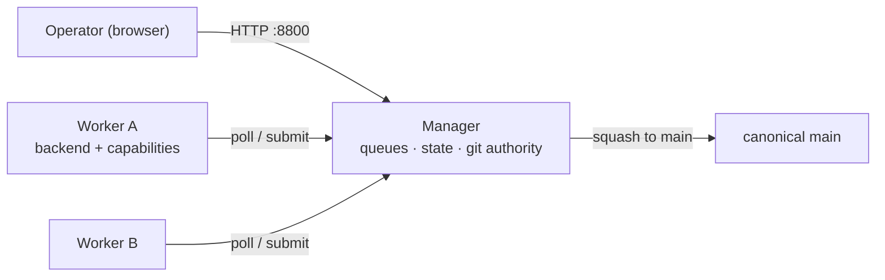

# Nightshift — Setup Guide

This guide brings Nightshift up from nothing on a single machine or VM, then shows how to add a second worker (same box or another one).
For the full list of every knob, see the [Configuration Reference](configuration-reference.md).

## What you are running

Nightshift is three cooperating pieces:

- **Manager** (`just manager`, default `:8800`) — owns the queues, the canonical briefs, the centralized config, Postgres-backed state and stats, the landing lock, and the git authority. It serves the operator UI and the worker/operator HTTP API.
- **Worker** (`just worker`, worker UI default `:8810`) — has its own clone, owns its backend (`claude-code` / `cursor` / `gemini` / `anthropic` / `ollama`), polls the manager for work, runs and validates it, then squash-submits the result for the manager to land. It also serves a minimal worker UI (Now + History).
- **Operator UI** — served by the manager at `:8800`; this is the product surface, where you add tasks, watch runs, compare backends, and configure routing.

Routing is pull-based: a worker advertises its capabilities (queues, priorities, models, MCP connectors) on every poll, and the manager hands back the first runnable task that fits.



## Prerequisites

- The repo is cloned and its Python environment is installed (`.venv` present — see the top-level [`README.md`](../README.md) bring-up).
- At least one backend's tooling is available on the worker machine (you only need the ones you intend to use):
  - `claude-code` — the `claude` CLI on `PATH`.
  - `cursor` — the `cursor-agent` CLI on `PATH`.
  - `gemini` — the `gemini` CLI on `PATH`, with an authenticated account or `GEMINI_API_KEY`.
  - `anthropic` — `ANTHROPIC_API_KEY` set (single-shot API backend, no CLI).
  - `ollama` — the `ollama` CLI on `PATH` (or an `ollama_host`).
- **Postgres is recommended but optional.** With a DSN (`NIGHTSHIFT_PG_DSN`) the manager persists state durably and every browser converges on the same source of truth. Without one it falls back to an in-memory store — fine for a quick try, but state is lost on restart and there is no cross-restart history. Nightshift owns its own DSN; it never reuses longitude's `LONG_PG_DSN`, so a clean Nightshift-only database on a separate host is the default posture (point `NIGHTSHIFT_PG_DSN` at the longitude DB explicitly if you want them to share one).

## The workspace

Everything Nightshift touches lives under a single **workspace** directory — the value passed as `--workspace` to the manager and each worker.
The workspace parents every git repo your workers operate on (each a direct child, e.g. `longitude/`), the `nightshift-tasks/` content-store repo (briefs + queue config), and the runtime dirs (`.worktrees/`, `.nightshift/`).
Settings now live in `<workspace>/.nightshift/{manager,worker,player}.json`; secrets in `<workspace>/.env`.

Because the config files live *inside* the workspace, the workspace itself is **not** a config key (that would be circular).
It is set, in precedence order:

1. `--workspace <dir>` on the command line (highest), then
2. `NIGHTSHIFT_WORKSPACE` from `.env` / the environment — read by the `just` recipes, which forward it as `--workspace`, then
3. the repo dir (`just`'s own directory) when neither is set.

`just manager` / `just worker` already forward `--workspace "$NIGHTSHIFT_WORKSPACE"` (falling back to the repo dir), so the simplest way to pin it is one line in `.env`:

```bash
# Absolute path (or $HOME/...) — the shell expands it; a literal "~" does not.
NIGHTSHIFT_WORKSPACE=$HOME/workspaces
```

The operator UI shows the bound workspace read-only (it is fixed for the life of the process); change it here and relaunch.
For a manager and a co-located worker on one VM, point both at the same directory — `$HOME/workspaces` is the recommended default.

## Quickstart — everything on one machine

This runs the manager and one worker co-located on a single box, both bound to `$HOME/workspaces`.

### 1. Configure the environment

Put secrets and launch vars in `.env` at the repo root:

```bash
# The workspace that parents your target repos + the nightshift-tasks content
# store (see "The workspace" above). Shared by the manager and co-located worker.
NIGHTSHIFT_WORKSPACE=$HOME/workspaces

# Where workers find the manager (also used by a co-located worker).
NIGHTSHIFT_MANAGER_URL=http://localhost:8800

# Durable state (recommended). Nightshift's own DSN — a clean, dedicated DB.
# Omit to use the in-memory fallback. This is never inherited from LONG_PG_DSN.
NIGHTSHIFT_PG_DSN=postgresql://nightshift@localhost:5432/nightshift

# A backend credential — whichever backend this worker will use.
ANTHROPIC_API_KEY=sk-ant-...
```

If you expose the manager beyond localhost, also set a shared secret on both sides (see step 4 and the reference): `NIGHTSHIFT_SHARED_SECRET=...`.

### 2. Scaffold the config files

Run `just init` to create `<workspace>/.nightshift/{manager,worker,player}.json` from the shipped templates and a `.env` from `.env.example`:

```bash
just init
```

Then edit the files to taste. The templates carry sensible defaults; see the [Configuration Reference](configuration-reference.md) for every knob.

### 3. Create the schema (Postgres only)

Nightshift carries its own migrations under `src/nightshift/assets/migrations/`, applied by the repo's `just migrate` recipe against `NIGHTSHIFT_PG_DSN`.

```bash
NIGHTSHIFT_PG_DSN=postgresql://nightshift@localhost:5432/nightshift just migrate
```

`just migrate` applies the migrations against `NIGHTSHIFT_PG_DSN`, so a clean dedicated database gets just the `nightshift` schema (workers, leases, tasks, runs, events, the capability columns, and the `queue_routing` table) — never longitude's schema. It is idempotent (tracked in `_meta.schema_migrations` in that DB) and errors out if `NIGHTSHIFT_PG_DSN` is unset. Skip it if you are using the in-memory fallback.

> The migrations are plain SQL, so on a host without `just` you can apply them directly: `psql "$NIGHTSHIFT_PG_DSN" -f src/nightshift/assets/migrations/20260730000001_nightshift_schema.sql` (then the `…_capability_routing.sql` and `…_repo_column.sql`). `just rollback` reverses them (drops the `nightshift` schema).

### 4. Start the manager

```bash
just manager        # binds :8800 (override: just manager 8801)
```

Open `http://localhost:8800` — that is the operator UI.

### 5. Start a worker

In a second terminal, declare the worker's backend and capabilities in `<workspace>/.nightshift/worker.json` (committed; per-box overrides come from env):

```json
{
  "worker_id": "vm-1",
  "backend": "claude-code",
  "manager_url": "http://localhost:8800",
  "models": ["claude-opus-4-8", "claude-sonnet-4-6"],
  "mcps": []
}
```

```bash
just worker         # polls the manager; worker UI on :8810
```

The same settings can come from `NIGHTSHIFT_*` environment variables instead (env wins over `worker.json`); see the reference.

### 6. Add work and watch it run

In the operator UI (`:8800`): add a task to a queue, and the worker will pick it up on its next poll, run it, validate, and submit. The manager fast-forwards canonical `main` under its landing lock. The worker's own UI at `:8810` shows what it is doing now plus its local history; the manager's Workers page shows all workers, per-backend/model/queue stats, advertised capabilities, and blocked tasks.

> The full recipe list is `just --list`; the day-to-day ones are `manager`, `worker`, `worker-headless`, `server`, `migrate` / `rollback`, `init`, and `validate`.

## Add a second worker

The point of a second worker is to run more tasks in parallel, or to compare backends/models head-to-head on the same queue. The manager treats each worker as independent and routes by the capabilities each one advertises.

### Same VM

A second co-located worker shares the manager's workspace — the same target repos and `nightshift-tasks/` store — so it only needs a distinct **identity** and **worker-UI port**. Each task runs in its own git worktree and the manager serializes landing, so co-located workers can share the workspace's repo clones safely.

Because `worker.json` is read from the shared `<workspace>`, give the second worker its distinguishing knobs as environment variables when you launch it (the environment wins over `worker.json`):

```bash
NIGHTSHIFT_WORKER_ID=vm-2 \
NIGHTSHIFT_WORKER_BACKEND=cursor \
NIGHTSHIFT_WORKER_MODELS=claude-opus-4-8,gpt-5.5 \
just worker 8811        # second worker UI on :8811 (the CLI arg overrides ui_port)
```

Both workers now poll the same manager. Because the first advertises `claude-code` models and the second a Cursor model set, the manager can compare them on identical tasks — the Workers page breaks down turns/tokens/cost per worker, backend, and model.

### A second (or remote) machine

1. Clone and install the repo on the new machine; make sure its backend tooling and credentials are present.
2. Point it at the manager and give it an identity in `.env` or `.nightshift/worker.json`:

```bash
NIGHTSHIFT_MANAGER_URL=http://manager-host:8800
NIGHTSHIFT_WORKER_ID=box-2
NIGHTSHIFT_WORKER_BACKEND=gemini
NIGHTSHIFT_WORKER_MODELS=gemini-3-pro,gemini-2.5-flash
# Must match the manager's secret if one is set:
NIGHTSHIFT_SHARED_SECRET=...
# Cross-machine landing: the git remote (resolved in each repo) this worker
# publishes its validated task branch to for the manager to fetch + land.
NIGHTSHIFT_RENDEZVOUS_REMOTE=origin
```

3. Start the worker:

```bash
just worker
```

Expose the manager's `:8800` to the worker's network and protect it with `NIGHTSHIFT_SHARED_SECRET` (the worker sends it as the `X-Nightshift-Secret` header on every call).

#### Cross-machine landing (the rendezvous remote)

Co-located workers share the manager's workspace, so the manager can squash the worker's branch directly. A worker on a *different* machine has its own clones, so its commits must reach the manager over git. Set `NIGHTSHIFT_RENDEZVOUS_REMOTE` (default `origin`) on both sides and the flow becomes:

1. The worker runs and **validates** the task (validation is the trust boundary), then pushes its branch to the rendezvous remote as `refs/heads/<prefix>/<queue>/<task>` and submits `branch_ref` + `head_sha` over the API. The `<prefix>` is the manager's `wip_ref_prefix` (default `nightshift-wip`), handed to the worker in the work order.
2. The manager fetches that ref into its own clone, verifies the tip matches `head_sha` (fail-closed on any mismatch), then runs its normal squash/drift/conflict landing. It prunes the WIP ref once consumed and keeps it on conflict for a resolve re-fetch.
3. The manager stays the **sole** writer of `main` and the sole PR author. A worker only ever pushes `<prefix>/*`.

Credentials: give each worker push access scoped to `<prefix>/*` only — never `main` or `task/*`. On GitHub use a deploy key/token plus branch protection on `main`; on a bare rendezvous host use a `pre-receive` hook rejecting writes outside `refs/heads/<prefix>/*`. Leave `NIGHTSHIFT_RENDEZVOUS_REMOTE` unset on a worker that shares the manager's workspace (co-located) — it then publishes nothing and the manager squashes locally as before.

The WIP namespace is configurable via the top-level `wip_ref_prefix` key (editable in the manager Settings UI as "Branch prefix"). It's read at launch, so a change applies on the next manager restart — and the credential scope above must move with it (`<new-prefix>/*`).

In `pr` landing mode the manager keeps `origin/main` authoritative: it resyncs its local `main` to `origin/main` before pinning each task's base and before each squash, so its local `main` and `origin/main` never diverge after GitHub re-squashes the merged PR. A task can force PR mode regardless of the manager default with `make_pr: true` in its brief frontmatter. See the [cross-machine landing spec](spec/remote-landing.md) for the full design.

## Targeting work at specific workers

Two mechanisms let you steer tasks:

- **Capability matching (automatic).** Pin a brief's `model:` to an id only one worker advertises, or declare `mcp:` connectors only one worker has, and the task self-routes there. If no live worker can serve it, the manager marks it blocked with a specific reason on the Workers page.
- **Queue dedication (manager-side).** On the Workers page, bind a queue to one or more worker ids: that queue's tasks are then offered only to those workers, while they still serve their other queues. Combined with a worker configured *without* certain MCP connectors, this fences a sensitive queue by configuration alone.

## Common operations

| Goal | Command |
|---|---|
| Scaffold workspace config | `just init` |
| Start the manager | `just manager [port]` |
| Start a worker | `just worker [ui-port]` |
| Run a worker with no UI (loop only) | `just worker-headless` (or `python -m nightshift.worker --workspace . --no-ui`) |
| Apply Nightshift DB schema | `NIGHTSHIFT_PG_DSN=… just migrate` |
| Lint + tests | `just validate` |

## Troubleshooting

- **Tasks stay pending.** Check the Workers page for blocked reasons. A pinned `model:` or declared `mcp:` with no live worker advertising it will block until a matching worker checks in.
- **A worker never appears.** Confirm `manager_url` is reachable from the worker and the `NIGHTSHIFT_SHARED_SECRET` matches on both sides.
- **Two workers fight on one box.** They must have distinct `worker_id` and `ui_port` and their own clones.
- **State resets on restart.** You are on the in-memory fallback; set `NIGHTSHIFT_PG_DSN` and run `just migrate` for durable state.
- **Cross-machine task errors with `publish_failed`.** The worker validated but could not push to its `rendezvous_remote`. Confirm the remote name resolves in the target repo on the worker and that its credential may push `<wip_ref_prefix>/*` (default `nightshift-wip/*`). Nothing lands; the branch is kept for a retry.
- **Cross-machine land is rejected (`merge_rejected`).** The fetched branch tip did not match the submitted `head_sha` (or no `rendezvous_remote`/`head_sha` reached the manager) — a fail-closed refusal so unverified content never lands. The WIP ref is kept; the next attempt re-fetches and re-verifies. A transient fetch error instead fails *recoverable* and is retried.
