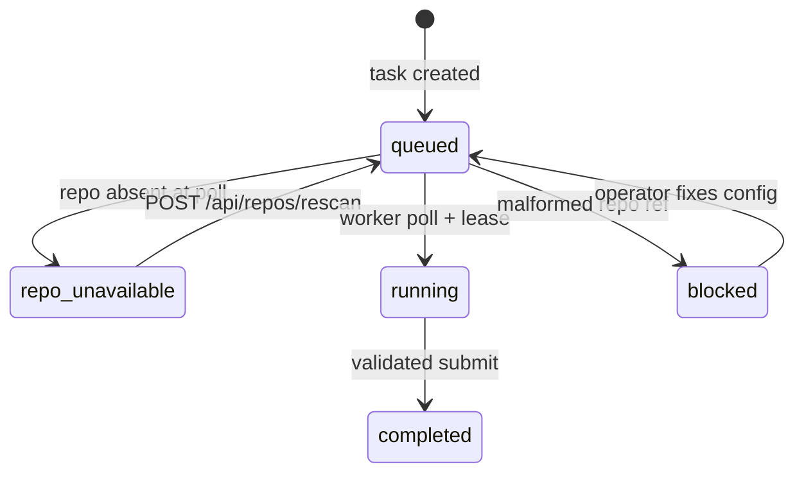

# Nightshift — Codebase Management Specification

**Subject:** How Nightshift manages multiple target codebases under one workspace: repo discovery, queue bindings, per-task overrides, availability pausing, and the two-root split between the content store and git operations.
**Status:** Descriptive — documents the feature **as implemented**. Where prose and code disagree, the code governs and this doc should be updated.
**Design lineage:** [`multi-repo-workspace.md`](multi-repo-workspace.md) (original design), [`multi-repo-impl-contract.md`](multi-repo-impl-contract.md) (engineering contract). This doc is the consolidated, current-state reference for operators and implementers.
**Primary sources:** `src/nightshift/repos.py`, `src/nightshift/playlists.py`, `src/nightshift/engine.py`, `src/nightshift/spawn_daily.py`, `src/nightshift/manager/{app.py,scheduler.py,landing.py,store.py}`, `src/nightshift/worker/execute.py`, `src/nightshift/assets/ui/{index.html,app.js,style.css}`, `src/nightshift/assets/migrations/20260730000003_nightshift_repo_column.sql`.

---

## 0. The one idea

Nightshift no longer treats a single `--root` directory as both the task queue and the git target.
Instead, manager and worker bind to a **`--workspace`** directory that parents **many git repos**.

Two responsibilities are split:

| Responsibility | Location | Role |
|---|---|---|
| Briefs + queue config | `<workspace>/<tasks_repo>/` (default `nightshift-tasks/`) | Content store — what to run |
| Git operations | `<workspace>/<repo>/` (per task) | Target codebase — where agents commit |

Every queue has a **default target repo** (`config.json` → `repo`).
An individual task may override it (frontmatter `repo:`).
All persisted references are **workspace-relative bare slugs** (`longitude`, not `/home/.../longitude`).

When a queue points at a repo that is not yet cloned into the workspace, tasks **pause** — they are not failed.
The operator clones the repo, presses **Rescan**, and paused tasks return to the queue automatically.

---

## 1. Workspace layout

The workspace is selected at launch (`--workspace` or `NIGHTSHIFT_WORKSPACE`) and is **not** editable at runtime.

```
<workspace>/
  .nightshift/              manager/worker/player config (committed)
  nightshift-tasks/         content-store git repo (briefs + queue config)
  longitude/                example target repo (direct child with .git)
  horizon/                  another target repo
  .worktrees/
    longitude/              worktrees, scratch briefs, landing locks (outside target repos)
    horizon/
  .nightshift-worker/       per-machine worker runtime state (gitignored)
```

Rules:

- Every repo Nightshift may touch is a **direct child** of the workspace.
- Nested paths (`group/repo`) are not supported.
- The content-store repo name is configurable (`tasks_repo` in `.nightshift/manager.json`, default `nightshift-tasks`).
- Absolute paths are materialised only transiently at filesystem/git call sites — never stored in config, work orders, or Postgres.

See also [Configuration Reference — The workspace](../configuration-reference.md#the-workspace).

---

## 2. Repo addressing (`repos.py`)

All repo logic lives in `src/nightshift/repos.py`.

| Function | Purpose |
|---|---|
| `is_valid_repo_ref(ref)` | Bare slug guard: `^[a-z0-9][a-z0-9-]*$` (reuses `playlists.is_valid_name`) |
| `repo_root(workspace, repo)` | Transient absolute path `<workspace>/<repo>` |
| `repo_available(workspace, repo)` | Direct child + contains `.git` |
| `known_repos(workspace)` | Sorted list of workspace children with `.git` |
| `resolve_repo(task_repo, queue_repo)` | Precedence: task frontmatter → queue default |

Two distinct failure classes:

1. **Malformed / unset reference** — path, `..`, `/`, absolute path, or no repo configured at all.
   Raises `RepoConfigError`.
   The manager marks the task **`blocked`** (authoring error).
   Never dispatched.

2. **Well-formed name, repo absent** — slug is valid but `<workspace>/<repo>` has no `.git`.
   Not an error.
   The manager marks the task **`repo_unavailable`** (rendered **Paused** in the UI).
   No run is started.
   Auto-resumes on rescan once the repo appears.

---

## 3. Queue and task bindings

### Queue default (`config.json`)

Each queue directory under the content store holds a `config.json`.
The **`repo`** key names the queue's default target codebase:

```json
{
  "order": ["01.add-widget", "02.fix-tests"],
  "repo": "longitude"
}
```

- Edited from the **Repos** page (per-queue selector) or **Playlist info** screen.
- Persisted via `PUT /api/queue/repo?queue=<label>` (or `PUT /api/queue/config` with the same body).
- Clearing the repo (`null` / empty) removes the key; a queue with no default and no per-task override is an authoring error at dispatch time.

### Per-task override (frontmatter)

A brief may pin a different target repo:

```yaml
---
title: Cross-repo fix
repo: horizon
priority: 3
---
```

- Edited from the task detail **Repo** dropdown in the UI.
- Resolution order: task `repo:` → queue `config.json` `repo`.
- Empty override inherits the queue default; the UI labels the empty choice with the inherited repo name when known.

### Playlist rescan (bootstrap)

`POST /api/playlists/rescan` scans the workspace for git repos and materialises one queue per discovered repo:

- Creates a queue directory named after the repo slug if absent.
- Sets (or resets) each queue's `repo` binding to the discovered repo name.
- Skips the content-store repo (`tasks_repo`).
- Commits changes to the content store when anything was created or reconfigured.

This is the fast path for standing up a multi-repo workspace: clone repos into the workspace, run rescan, get one queue per repo with bindings already set.

---

## 4. Content store (`nightshift-tasks`)

The content store is a dedicated git repo sibling to the target repos.
It holds **only** briefs and queue config — never implementation code.

```
nightshift-tasks/
  main/                     default queue
    *.md
    config.json
  longitude/                alternate queue (same name as its target repo is common)
    *.md
    config.json
  config.json               optional workspace-level runner defaults
```

- Every queue is a top-level directory; `main` is the default queue (`playlists.DEFAULT_QUEUE`).
- There is no literal `.tasks/` directory anymore.
- The manager commits brief/config churn locally on create, edit, complete, and rescan.
- No remote is required; pushing the content store is a separate, opt-in concern.

Config inheritance (`spawn_daily.resolve_config`), low to high priority:

1. `.nightshift/manager.json` (operator/host policy)
2. `nightshift-tasks/config.json` (optional store-wide layer)
3. `<queue>/config.json` (per-queue overrides, including `repo`)

The `repo` key is **per-queue only** — it is not inherited from higher layers.

---

## 5. Availability lifecycle



During `worker_poll`, for each candidate task:

1. **Resolve** repo via `resolve_repo`.
   `RepoConfigError` → `blocked` with reason; excluded from dispatch.
2. **Check availability** via `repo_available`.
   Absent → `repo_unavailable`; excluded from dispatch.
3. **Warn once per queue** whose default repo is unavailable (deduped in `app.state.repo_warnings`).
4. On successful dispatch, clear any prior `repo_unavailable` or `blocked` overlay for that task.

**Rescan** (`POST /api/repos/rescan`):

1. Recompute the known-repos set.
2. For every task in state `repo_unavailable` whose repo is now available, clear task state → back to `queued`.
3. Reset the per-queue warning dedupe set.
4. Emit `repos_changed` SSE event.

The manager **never clones** missing repos.
Operator flow: `git clone …` into the workspace → **Rescan** → paused tasks resume.

---

## 6. Execution flow

### Work order shape

When a worker receives a lease, the work order includes:

```jsonc
{
  "lease_id": "...",
  "run_id": "...",
  "task": "01.add-widget",
  "queue": "main",
  "priority": 3,
  "title": "Add widget",
  "body": "<brief markdown, frontmatter stripped>",
  "repo": "longitude",
  "task_path": "nightshift-tasks/main/01.add-widget.md",
  "base_ref": "<canonical HEAD of repo_root>",
  "config": { "model": "...", "validate_cmd": "...", ... }
}
```

No absolute paths cross the wire.
`base_ref` is pinned at dispatch time from `canonical_head(repo_root)`.

### Worktrees and brief delivery

Git operations run in `repo_root = workspace / repo`.
Worktrees live **outside** the target repo:

```
<workspace>/.worktrees/<repo>/task-local-<queue>-<task>/     worktree checkout
<workspace>/.worktrees/<repo>/task-local-<queue>-<task>.taskfile.md   scratch brief
```

- `setup_worktree(workspace, repo, task, queue=…)` cuts the worktree from `repo_root`.
- `materialize_brief(…)` writes the embedded brief body to the scratch file.
- The worker points `$TASK_FILE` at the scratch path; the brief never enters the target repo's tracked tree.
- On completion, only the **implementation squash commit** lands in the target repo's `main`.
- The manager removes the brief from the content store (`drop_completed_task` + commit).

### Landing

The manager is the **sole writer of each target repo's `main`**.
Landing is serialised per repo via `landing_lock(workspace, repo)`.
See [`remote-landing.md`](remote-landing.md) for cross-machine transport when worker and manager do not share a workspace.

### Blocked tasks (agent-reported)

Distinct from `repo_unavailable` and config `blocked`:

- The agent emits `NIGHTSHIFT_BLOCKED: <reason>` and makes no commits.
- The worker reports `status=blocked`; the manager records DB state `blocked`.
- No `.BLOCKED` file is written into target repos.

---

## 7. Operator UI

All codebase management surfaces talk to the manager HTTP API only.

### Repos page (`data-view="repos"`)

- **Workspace** — read-only path (bound at process launch).
- **Known repos** — workspace children with `.git`; the content store is tagged "tasks store".
- **Queue bindings** — each queue's default repo + availability badge + editable selector.
- **Rescan** — `POST /api/repos/rescan`; resumes paused tasks when repos appear.
- **Warnings** — one banner per queue bound to an absent repo.

### Task detail

- **Repo** dropdown — optional per-task override; empty choice shows inherited queue repo.
- Run history and queue rows show the target `repo` slug.

### Playlists

- **Playlist info** — edit queue name, default repository, and validate command.
- **Rescan workspace** — create/configure queues from discovered repos (`POST /api/playlists/rescan`).

### State rendering

| DB state | UI label | CSS treatment |
|---|---|---|
| `repo_unavailable` | Paused | `.status.paused` |
| `blocked` | Blocked | blocked styling |
| (normal) | Queued / Running / … | per existing status map |

---

## 8. HTTP API

| Method | Path | Purpose |
|---|---|---|
| `GET` | `/api/repos` | Known repos, per-queue bindings, warnings |
| `POST` | `/api/repos/rescan` | Rescan workspace + auto-resume paused tasks |
| `GET` | `/api/queue/repo?queue=<label>` | Read a queue's default repo |
| `PUT` | `/api/queue/repo?queue=<label>` | Set/clear a queue's default repo (`{"repo": "…"}` or `null`) |
| `POST` | `/api/playlists/rescan` | Create/configure queues from workspace repos |
| `PUT` | `/api/playlists/<name>` | Edit queue metadata (`repository`, `validate`, rename) |
| `POST/PATCH` | `/api/tasks` | Task create/edit includes optional `repo` override |

The legacy single-host **server** mirrors `GET/POST /api/repos`, `GET/PUT /api/queue/repo`, and playlist rescan so the shared UI works there too.

Worker-facing endpoints carry `repo` on leases, runs, and submit payloads; see [Configuration Reference — HTTP surface](../configuration-reference.md#http-surface-reference).

---

## 9. Database

Migration `20260730000003_nightshift_repo_column.sql` adds:

- `nightshift.tasks.repo` — persisted when a task enters `repo_unavailable` or is dispatched.
- `nightshift.runs.repo` — recorded on every run for history/filtering.

`store.tasks_in_state("repo_unavailable")` drives rescan auto-resume.

---

## 10. Startup and co-location

- Manager and co-located workers on one box **must share the same workspace**.
- Workers validate that `workspace` exists at startup; per-task repo availability is the manager's concern (pause, not startup failure).
- Co-located workers share the workspace's repo clones; worktrees and landing locks prevent collisions.
- Cross-machine workers need rendezvous-remote landing; see [`remote-landing.md`](remote-landing.md).

Launch wiring:

```bash
# .env
NIGHTSHIFT_WORKSPACE=$HOME/workspaces

# justfile forwards --workspace
just manager
just worker
```

---

## 11. Invariants

1. **One workspace, many repos.** Every touched repo is a direct child of `--workspace`.
2. **Two roots, one source each.** Briefs/config from `tasks_root`; git ops in `repo_root`; never conflated.
3. **Queue bound to a repo.** Queue `config.json` sets default; task may override; order task → queue.
4. **Workspace-relative paths only.** No absolute paths in config, work orders, or DB.
5. **Missing repo pauses, never fails.** Well-formed absent repo → `repo_unavailable` + one warning per queue; auto-resumes on rescan.
6. **Target repo stays clean.** Briefs never enter the worktree; worktrees live outside the repo; only the impl squash lands.
7. **Content store is git-tracked and local.** Briefs + queue config only; no required remote.

---

## 12. Out of scope

- **Automatic cloning** — the manager never clones missing repos.
- **Nested repo paths** — only direct workspace children are addressable.
- **Multi-machine content-store sync** — `nightshift-tasks` stays local; see [`remote-landing.md`](remote-landing.md) for code transport only.
- **Periodic background rescan** — rescan is operator-triggered (UI button or API); no config-driven auto-rescan yet.

---

## 13. Related docs

| Doc | Covers |
|---|---|
| [`multi-repo-workspace.md`](multi-repo-workspace.md) | Original design rationale and migration from `--root` |
| [`multi-repo-impl-contract.md`](multi-repo-impl-contract.md) | Module-level signatures for implementers |
| [`remote-landing.md`](remote-landing.md) | Cross-machine branch transport |
| [`playlists.md`](playlists.md) | Queue/playlists model (updated for `tasks_root` layout) |
| [`../configuration-reference.md`](../configuration-reference.md) | Config keys, env vars, workspace setup |
| [`../ARCHITECTURE.md`](../../ARCHITECTURE.md) | System topology and component map |
