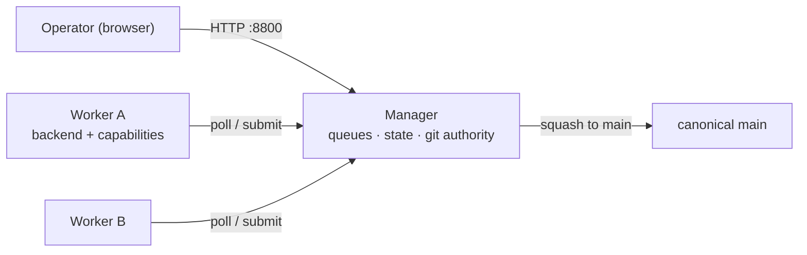

# Nightshift — Setup Guide

This guide brings Nightshift up from nothing on a single machine or VM, then shows how to add a second worker (same box or another one).
For the full list of every knob, see the [Configuration Reference](configuration-reference.md).

## What you are running

Nightshift is three cooperating pieces:

- **Manager** (`just nightshift-manager`, default `:8800`) — owns the queues, the canonical `.tasks/` briefs, the centralized `config.json`, Postgres-backed state and stats, the landing lock, and the git authority. It serves the operator UI and the worker/operator HTTP API.
- **Worker** (`just nightshift-worker`, worker UI default `:8810`) — has its own clone, owns its backend (`claude-code` / `cursor` / `gemini` / `anthropic` / `ollama`), polls the manager for work, runs and validates it, then squash-submits the result for the manager to land. It also serves a minimal worker UI (Now + History).
- **Operator UI** — served by the manager at `:8800`; this is the product surface, where you add tasks, watch runs, compare backends, and configure routing.

Routing is pull-based: a worker advertises its capabilities (queues, priorities, models, MCP connectors) on every poll, and the manager hands back the first runnable task that fits.



## Prerequisites

- The repo is cloned and its Python environment is installed (`.venv` present — see the top-level [`README.md`](../../README.md) bring-up).
- At least one backend's tooling is available on the worker machine (you only need the ones you intend to use):
  - `claude-code` — the `claude` CLI on `PATH`.
  - `cursor` — the `cursor-agent` CLI on `PATH`.
  - `gemini` — the `gemini` CLI on `PATH`, with an authenticated account or `GEMINI_API_KEY`.
  - `anthropic` — `ANTHROPIC_API_KEY` set (single-shot API backend, no CLI).
  - `ollama` — the `ollama` CLI on `PATH` (or an `ollama_host`).
- **Postgres is recommended but optional.** With a DSN (`NIGHTSHIFT_PG_DSN`) the manager persists state durably and every browser converges on the same source of truth. Without one it falls back to an in-memory store — fine for a quick try, but state is lost on restart and there is no cross-restart history. Nightshift owns its own DSN; it never reuses longitude's `LONG_PG_DSN`, so a clean Nightshift-only database on a separate host is the default posture (point `NIGHTSHIFT_PG_DSN` at the longitude DB explicitly if you want them to share one).

## Quickstart — everything on one machine

This runs the manager and one worker co-located on a single box.

### 1. Configure the environment

Put operator/manager settings in `.env` at the repo root:

```bash
# Where workers find the manager (also used by a co-located worker).
NIGHTSHIFT_MANAGER_URL=http://localhost:8800

# Durable state (recommended). Nightshift's own DSN — a clean, dedicated DB.
# Omit to use the in-memory fallback. This is never inherited from LONG_PG_DSN.
NIGHTSHIFT_PG_DSN=postgresql://nightshift@localhost:5432/nightshift

# A backend credential — whichever backend this worker will use.
ANTHROPIC_API_KEY=sk-ant-...
```

If you expose the manager beyond localhost, also set a shared secret on both sides (see step 4 and the reference): `NIGHTSHIFT_SHARED_SECRET=...`.

### 2. Create the schema (Postgres only)

Nightshift carries its own migrations and its own `just` recipe, separate from longitude. They live in `tools/nightshift/migrations/` and `tools/nightshift/justfile`, so this directory is self-contained — you can copy it to the database host and run it there.

```bash
cd tools/nightshift
NIGHTSHIFT_PG_DSN=postgresql://nightshift@localhost:5432/nightshift just migrate-nightshift
```

`migrate-nightshift` applies the migrations in `tools/nightshift/migrations/` against `NIGHTSHIFT_PG_DSN`, so a clean dedicated database gets just the `nightshift` schema (workers, leases, tasks, runs, events, the capability columns, and the `queue_routing` table) — never longitude's schema. It is idempotent (tracked in `_meta.schema_migrations` in that DB) and errors out if `NIGHTSHIFT_PG_DSN` is unset. Skip it if you are using the in-memory fallback.

> The migrations are plain SQL, so on a host without `just` you can apply them directly: `psql "$NIGHTSHIFT_PG_DSN" -f tools/nightshift/migrations/20260730000001_nightshift_schema.sql` (then the `…_capability_routing.sql`). `just rollback-nightshift` reverses them (drops the `nightshift` schema).

### 3. Start the manager

```bash
just nightshift-manager        # binds :8800 (override: just nightshift-manager 8801)
```

Open `http://localhost:8800` — that is the operator UI.

### 4. Start a worker

In a second terminal, declare the worker's backend and capabilities, then run it. The cleanest place for a worker's own knobs is `tools/nightshift/config.json.local` (gitignored):

```json
{
  "worker_id": "vm-1",
  "backend": "claude-code",
  "manager_url": "http://localhost:8800",
  "models": ["claude-opus-4-8", "claude-sonnet-4-6"],
  "mcps": []
}
```

```bash
just nightshift-worker         # polls the manager; worker UI on :8810
```

The same settings can come from `NIGHTSHIFT_*` environment variables instead (env wins over `config.json.local`); see the reference.

### 5. Add work and watch it run

In the operator UI (`:8800`): add a task to a queue, and the worker will pick it up on its next poll, run it, validate, and submit. The manager fast-forwards canonical `main` under its landing lock. The worker's own UI at `:8810` shows what it is doing now plus its local history; the manager's Workers page shows all workers, per-backend/model/queue stats, advertised capabilities, and blocked tasks.

> Operator-only commands (`just long-ui`, `just expunge`, `just kill-all`) are global and not worker-scoped — run them from your console, never from an agent worktree.

## Add a second worker

The point of a second worker is to run more tasks in parallel, or to compare backends/models head-to-head on the same queue. The manager treats each worker as independent and routes by the capabilities each one advertises.

### Same VM

The runtime on one box is global, so a second co-located worker must not collide with the first. Give it three distinct things: its own clone (or worktree), a distinct `worker_id`, and a distinct worker-UI port.

1. Use a separate checkout of the repo for the second worker (its own working tree; workers each need their own clone). Share the `.venv` by symlink if you like.
2. In that checkout's `tools/nightshift/config.json.local`:

```json
{
  "worker_id": "vm-2",
  "backend": "cursor",
  "manager_url": "http://localhost:8800",
  "models": ["claude-opus-4-8", "gpt-5.5"],
  "mcps": [],
  "ui_port": 8811
}
```

3. Start it:

```bash
just nightshift-worker         # uses ui_port 8811 from config.json.local
# or override on the CLI:
just nightshift-worker 8811
```

Both workers now poll the same manager. Because the first advertises `claude-code` models and the second advertises a Cursor model set, the manager can compare them on identical tasks — the Workers page breaks down turns/tokens/cost per worker, backend, and model.

### A second (or remote) machine

1. Clone and install the repo on the new machine; make sure its backend tooling and credentials are present.
2. Point it at the manager and give it an identity in `.env` or `config.json.local`:

```bash
NIGHTSHIFT_MANAGER_URL=http://manager-host:8800
NIGHTSHIFT_WORKER_ID=box-2
NIGHTSHIFT_WORKER_BACKEND=gemini
NIGHTSHIFT_WORKER_MODELS=gemini-3-pro,gemini-2.5-flash
# Must match the manager's secret if one is set:
NIGHTSHIFT_SHARED_SECRET=...
```

3. Start the worker:

```bash
just nightshift-worker
```

Expose the manager's `:8800` to the worker's network and protect it with `NIGHTSHIFT_SHARED_SECRET` (the worker sends it as the `X-Nightshift-Secret` header on every call).

## Remote (cross-machine) landing

By default the worker and manager share one checkout, so a worker's task branch is already visible to the manager and landing is a local squash.
When a worker runs on a different machine, set a git **rendezvous remote** so the branch can travel to the manager:

1. Configure both sides to point at the same remote (a git repo both can reach): set `NIGHTSHIFT_RENDEZVOUS_REMOTE` on the worker (e.g. `origin`) — this is the opt-in switch — and, if it differs from `origin`, on the manager too.
2. Give the worker scoped push access limited to the `nightshift-wip/*` ref namespace; it never needs write access to `main`.
3. Nothing else changes operationally: the worker still only validates + submits, and the manager remains the sole writer of `main` and the sole PR author.

Under the hood the worker pushes its validated `task-local/<queue>/<task>` branch to `nightshift-wip/<queue>/<task>` and reports the ref + tip SHA on submit.
The manager fetches that ref, verifies the SHA, runs its normal drift/squash/landing-mode path, and prunes the `nightshift-wip` ref once the change has landed.
On a conflict the ref is preserved so a resolve run can pick it up.
See `docs/nightshift/spec/remote-landing.md` for the full design (and the future bundle-over-API transport).

## Targeting work at specific workers

Two mechanisms let you steer tasks:

- **Capability matching (automatic).** Pin a brief's `model:` to an id only one worker advertises, or declare `mcp:` connectors only one worker has, and the task self-routes there. If no live worker can serve it, the manager marks it blocked with a specific reason on the Workers page.
- **Queue dedication (manager-side).** On the Workers page, bind a queue to one or more worker ids: that queue's tasks are then offered only to those workers, while they still serve their other queues. Combined with a worker configured *without* certain MCP connectors, this fences a sensitive queue by configuration alone.

## Common operations

| Goal | Command |
|---|---|
| Start the manager | `just nightshift-manager [port]` |
| Start a worker | `just nightshift-worker [ui-port]` |
| Run a worker with no UI (loop only) | `python -m nightshift.worker --root . --no-ui` |
| Apply Nightshift DB schema | `cd tools/nightshift && NIGHTSHIFT_PG_DSN=… just migrate-nightshift` |
| Scoped Nightshift tests | `just validate-nightshift` |

## Troubleshooting

- **Tasks stay pending.** Check the Workers page for blocked reasons. A pinned `model:` or declared `mcp:` with no live worker advertising it will block until a matching worker checks in.
- **A worker never appears.** Confirm `manager_url` is reachable from the worker and the `NIGHTSHIFT_SHARED_SECRET` matches on both sides.
- **Two workers fight on one box.** They must have distinct `worker_id` and `ui_port` and their own clones.
- **State resets on restart.** You are on the in-memory fallback; set `NIGHTSHIFT_PG_DSN` and run `just migrate-nightshift` (from `tools/nightshift`) for durable state.
